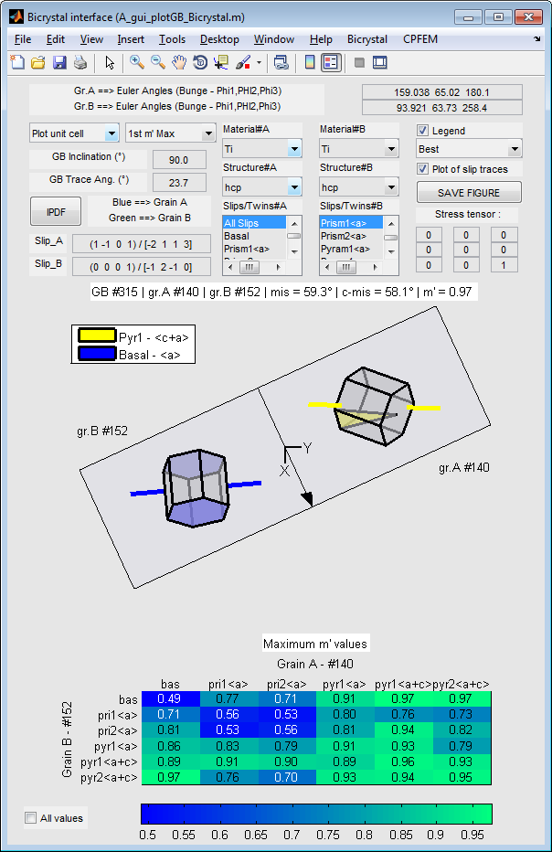
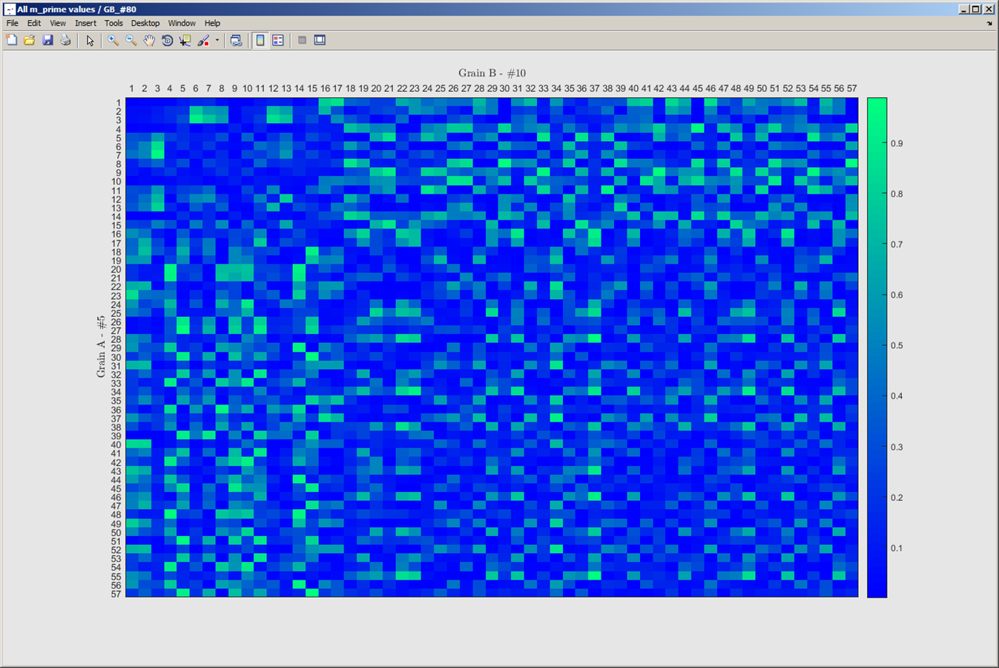

Bicrystal GUI
=============

..  |matlab| replace:: Matlab\ :sup:`TM` \

This GUI allows to analyze quantitatively slip transmission across grain boundaries for a single bicrystal selected from the EBSD map plotted previously in the map GUI
or set by the user (directly inside the bicrystal GUI or by loading a `YAML config. bicrystal <https://github.com/stabix/stabix/tree/master/gui_bicrystal/gui_bicrystal_data/Kacher2012/Kacher2012_Fig.12.yaml>`_ file from the menu).

The |matlab| function used to run the bicrystal GUI is: `A_gui_plotGB_Bicrystal.m <https://github.com/stabix/stabix/tree/master/gui_bicrystal/A_gui_plotGB_Bicrystal.m>`_

This includes:

* :ref:`bicrystal_from_map`
* :ref:`all_mprime_values`

.. _bicrystal_from_map:

Plotting and analyzing a bicrystal
----------------------------------

   
   *Figure 1 : Screenshot of the Bicrystal GUI*
   
.. _all_mprime_values:

Distribution of all slip transmission parameters
------------------------------------------------

It is possible to generate a new window, in which all values of the selected slip transmission parameter are plotted in function of selected slip families.

   
   *Figure 2 : Screenshot of the distribution of all slip transmission parameters (e.g.: m' parameter for a 1 phase (hcp) bicrystal)*