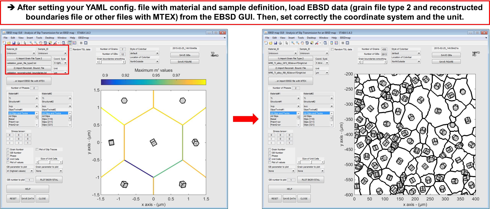
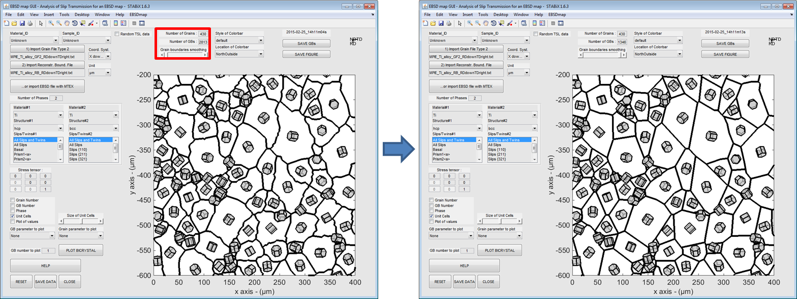
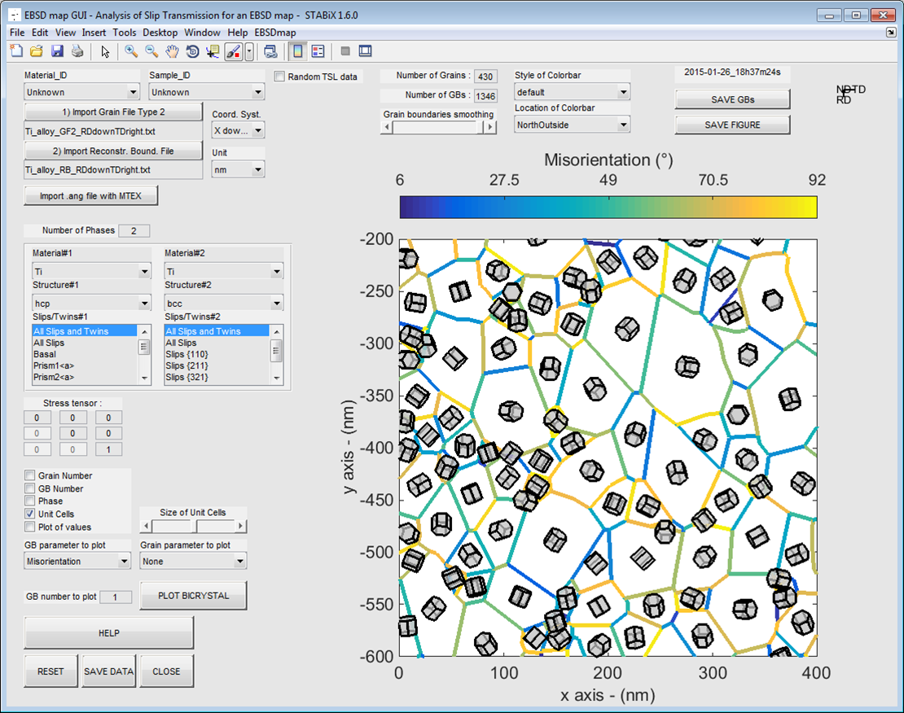
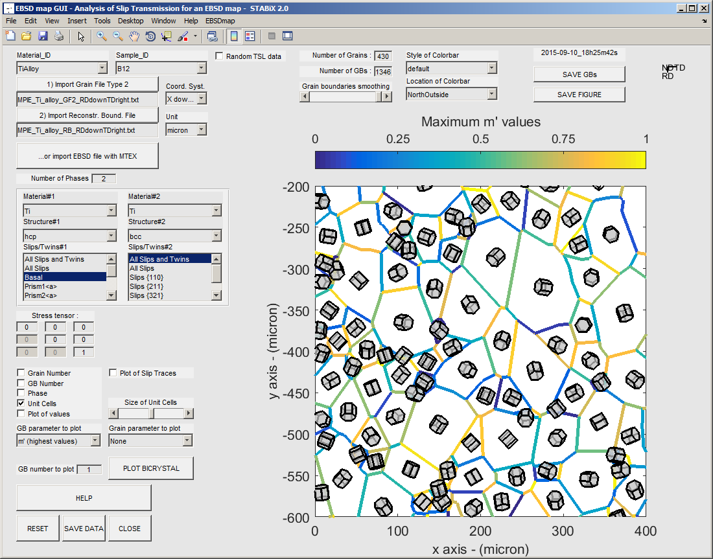
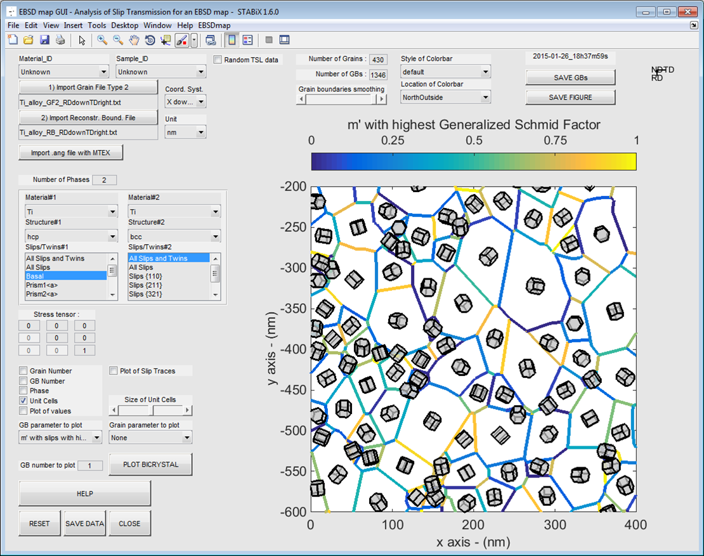
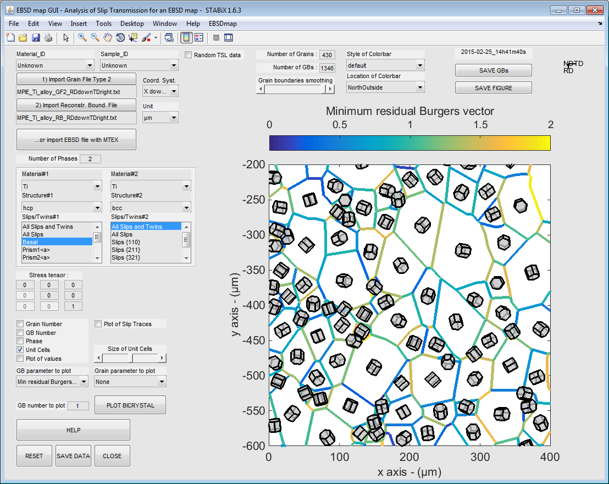
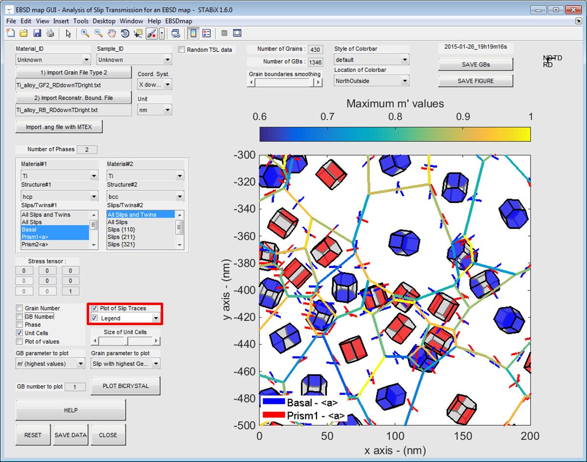

EBSD map GUI
============

.. include:: includes.rst
 
This GUI allows to analyze quantitatively slip transmission across grain boundaries for an EBSD map.

The |matlab| function used to run the EBSD map GUI is: `A_gui_plotmap.m <https://github.com/stabix/stabix/tree/master/gui_ebsd_map/A_gui_plotmap.m>`_

This includes:

* :ref:`loading_GBs`
* :ref:`smoothing_GBs`
* :ref:`misorientation_angle`
* :ref:`mp_parameter`
* :ref:`residual_Burgers_vector`
* :ref:`Schmid_factor_slip_traces`

.. _loading_GBs:

Loading EBSD data
---------------------------

For more details about the format of the EBSD data, see also the page `Experimental data <http://stabix.readthedocs.org/en/latest/experimental_data.html>`_.

   
   *Figure 1 : How to set a an EBSD map ?*

.. _smoothing_GBs:

Smoothing GBs segments
------------------------

   
   *Figure 2 : Screenshot of the EBSD map GUI with an EBSD map of near alpha phase
   Ti alloy a) before smoothing and b) after smoothing.*

.. _misorientation_angle:

Misorientation angle
--------------------

   
   *Figure 3 : Screenshot of the EBSD map GUI with an EBSD map of near alpha phase Ti alloy
   (GBs color-coded in function of the maximum misorientation angle value).*

.. _mp_parameter:

m' parameter
------------

   
   *Figure 4 : Screenshot of the EBSD map GUI with an EBSD map of near alpha phase Ti alloy
   (GBs color-coded in function of the maximum m' value).*

   
   *Figure 5 : Screenshot of the EBSD map GUI with an EBSD map of near alpha phase Ti alloy
   (GBs color-coded in function of the maximum m' value obtained for slips with the highest generalized Schmid factor).*
   
.. _residual_Burgers_vector:

Residual Burgers vector
-----------------------

   
   *Figure 6 : Screenshot of the EBSD map GUI with an EBSD map of near alpha phase Ti alloy
   (GBs color-coded in function of the maximum residual Burgers vector value).*
   
.. _Schmid_factor_slip_traces:

Schmid factor and slip trace analysis
-------------------------------------

   
   *Figure 7 : Screenshot of the EBSD map GUI with an EBSD map of near alpha phase Ti alloy (slip plane plotted inside grain and 
   slip traces plotted around unit cells, both in function of the maximum Schmid factor calculated with a given stress tensor).*
   
