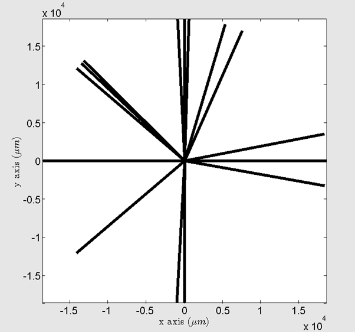

Experimental data
===================

.. include:: includes.rst

To use the |stabix| toolbox, some experimental data are required:

- average grain orientations (Euler angles (:math:`\phi_{1}`, :math:`\Phi`, :math:`\phi_{2}`) in degrees) or
  intragranular misorientation (misorientation axis :math:`[uvw]` / angle :math:`\omega`);

- grains boundaries positions (optional for the bicrystal analysis);

- grains positions (optional for the bicrystal analysis);

- geometry of grain boundaries (trace angle and grain boundary inclination) (optional).

TEM experiments can provide intragranular misorientation and EBSD measurements
can provide average grain orientations, grains boundaries and grains positions,
and grain boundary trace angle.

Inclination of the grain boundary can be evaluated by serial polishing or focused ion beam (FIB) sectioning,
either parallel or perpendicular to the surface of the sample.

EBSD map GUI
***************

To plot EBSD map in the EBSD map GUI, two types of TSL-OIM files are required:

- Reconstructed Boundaries File;

- Grain File Type 2.

TSL-OIM data preparation
--------------------------

Open you .osc (or your .ctf) file in the TSL-OIM Analysis Software.

.. warning::
    Set the TSL coordinates system !

Change data properties for the detection of grain boundaries (All data --> Properties).

Clean up your dataset (Filename --> Cleanup).

Reference : OIM ANALYSIS 6.0 (user manual) and OIM ANALYSIS 7.0 (user manual) / `EDAX website <http://www.edax.com/Products/EBSD/OIM-Data-Analysis-Microstructure-Analysis.aspx>`_
	
Reconstructed Boundaries File (RB)
----------------------------------

**Export "Reconstructed Boundaries File" of the cleaned dataset**
(All data --> Export --> Reconstructed Boundaries), with the following options defined by default:

- Right hand average orientation (:math:`\phi_{1}`, :math:`\Phi`, :math:`\phi_{2}`) in degrees;

- Left hand average orientation (:math:`\phi_{1}`, :math:`\Phi`, :math:`\phi_{2}`) in degrees;

- Trace angle (in degrees);

- (:math:`x,y`) coordinates of endpoints (in microns);

- IDs of right hand and left hand grains.

.. note::
    Reconstructed boundary methodology is only applied to data collected on a hexagonal grid.
    Nevertheless, it is possible to convert a square grid into an hexagonal grid in TSL-OIM software.

.. warning::
    It is not possible to export a "Reconstructed Boundaries File", containing "opened" grain boundaries.

Example of "Reconstructed Boundary File": `MPIE_cpTi_reconstructed_boundaries_2013.txt
<https://github.com/stabix/stabix/tree/master/gui_ebsd_map/ebsd_dataExamples/MPIE_cpTi_reconstructed_boundaries_2013.txt>`_

The |matlab| function used to read "Reconstructed Boundary File" is:
`read_oim_reconstructed_boundaries_file.m <https://github.com/stabix/stabix/blob/master/read_write_ebsd_files/read_oim_reconstructed_boundaries_file.m>`_

If some GBs segments are missing or some wrong segments are exported, play with partition
properties in the TSL-OIM software in order to export a more realistic Reconstructed Boundaries file:

- decrease/increase "Grain Tolerance Angle";

- decrease/increase "Minimum Grain Size";

- decrease/increase the maximum deviation between reconstructed boundary and corresponding boundary segments.

Grain File Type 2 (GF2)
-----------------------

**Export "Grain File Type 2" of the cleaned dataset** (All data --> Export --> Grain File), with the following options:

- Integer identifying grain;

- Average orientation (:math:`\phi_{1}`, :math:`\Phi`, :math:`\phi_{2}`) in degrees;

- Average position (:math:`x,y`) in microns;

- An integer identifying the phase;

- Edge or interior grain (optional);

- Diameter of the grain in microns (optional).

.. note::
    Export the "Grain File Type 2" in the same location as the corresponding "Reconstructed Boundary File".

Example of "Grain Gile Type 2":
`MPIE_cpTi_grain_file_type2_2013.txt <https://github.com/stabix/stabix/tree/master/gui_ebsd_map/ebsd_dataExamples/MPIE_cpTi_grain_file_type2_2013.txt>`_

The |matlab| function used to read "Grain File Type 2" is :
`read_oim_grain_file_type2.m <https://github.com/stabix/stabix/blob/master/read_write_ebsd_files/read_oim_grain_file_type2.m>`_

Loading other type of EBSD data files...
-----------------------------------------

It is possible to load other type of EBSD data files (e.g. : .ang files, .ctf files, ...), using the 'import_wizard' of the MTEX toolbox. It is always better to process (cropping, cleaning, filling, etc...) EBSD dataset using commercial EBSD software before loading it in the STABiX toolbox.

First, download and install the `MTEX Toolbox <http://mtex-toolbox.github.io/>`_.

Then, import your EBSD data, by pressing the dedicated button on the main GUI.
Please, set up carefully parameters for grain calculation (minimum misorientation, minimum grain size, grain boundary length...).
In the case of too many grains (>100) or too many grain boundaries (>1000), which is usually linked and due to low quality EBSD map or not enough crystallized samples, the loading of the data + and plotting into the GUI can take some time.
Please check the warnings in the 'Command window' of Matlab.
Set the crystal symmetry by selecting the .cif file corresponding to your material, set the coordinate system and set the reference frame.

The 'import_wizard' tool from the MTEX toolbox can be alternatively used to import your EBSD data (see comments in the `function <https://github.com/stabix/stabix/blob/master/mtexFunctions/mtex_getEBSDdata.m>`_). In this case, you have to save the EBSD dataset in the |matlab| workspace as a variable named 'ebsd', and press 'Finish'.

The EBSD map is automatically plotted from the imported data.
The coordinate system and the scan unit are set from the properties of the imported data.

GF2 and RB files are automatically created after this raw EBSD data loading step and saved in the main Matlab search path. The function for this step is: https://github.com/stabix/stabix/blob/master/mtexFunctions/mtex_convert2TSLdata.m

.. note::
    For a single phase material, the phase number is 0 or 1. For a two phases material, the phase numbers are
    respectively 1 and 2. For non-indexed pixels, the phase is numbered as -1.

How to generate a .ang file with TSL-OIM software?
----------------------------------------------------

**Export "Scan Data (.ang file)" of the cleaned dataset** (Filename --> Export --> Scan Data) (optional).

Example of an `.ang file. <https://github.com/stabix/stabix/blob/master/gui_ebsd_map/ebsd_dataExamples/validation1_AngFile(forMTEX).ang>`_

The |matlab| functions used to generate .ang file v6 and v7 are respectively:

- `write_oim_ang_file_v6.m <https://github.com/stabix/stabix/blob/master/read_write_ebsd_files/write_oim_ang_file_v6.m>`_ ;

- `write_oim_ang_file_v7.m <https://github.com/stabix/stabix/blob/master/read_write_ebsd_files/write_oim_ang_file_v7.m>`_.

Possible errors introduced during files exportation from TSL-OIM
------------------------------------------------------------------

- "Grain File Type 2" --> Missing integer identifying grain
    - Solved when file is imported via the GUI.

- "Reconstructed Boundary File" --> Inversion of left and right grains for a given grain boundary 
    - Cross product performed between GB vector and center of grains to check (if cross product < 0 : no inversion, and if cross product > 0 : inversion).

- "Reconstructed Boundary File" --> :math:`x`-axis and :math:`y`-axis not corrects…
    - :math:`y` coordinates is multiplied by -1 when file is imported via the GUI.

.. note::
    All of these issues are taken into account and corrected automatically when user is loading his data via the EBSD map GUI.
	
.. warning::
    It is required to create GF2 and RB files with grain indexation starting from 0. Be careful with cropped datasets.
	
Issues with plot of EBSD maps
---------------------------------

Sometimes, grain boundaries coordinates are too big compared to the grain size, because of
the Voronoi tesselation for example. Thus, the following plot can be obtained:

   
   *Screenshot of the EBSD map GUI with a problem of axis limits.*
   
In this case, it is advised to use the `'zoom' function of Matlab <http://de.mathworks.com/help/matlab/creating_plots/enlarging-the-view.html>`_
to zoom in and zoom out in the center of the EBSD map, to vizualize the grains. It is also possible to set directly the limits of axis (e.g.: xlim([0 1500]); ylim([-1000 0]);) in the command window of Matlab.

Bicrystal GUI 
**************

**The YAML configuration file provides a simple way to define a bicrystal.**

An example of bicrystal configuration file is given here :
`config_gui_BX_defaults.yaml <https://github.com/stabix/stabix/tree/master/yaml_config_files/config_gui_BX_defaults.yaml>`_

Copy this example file and modify it with your data. Be careful to put a space after the comma in a list (e.g. [:math:`x`, :math:`y`, :math:`z`]).

.. warning::
    Don't change field names and don't round Euler angles. Euler angles are given in degrees.

Load your YAML bicrystal configuration file via the menu in the bicrystal GUI. You may have to run again the path_management.m |matlab| function, if your YAML bicrystal configuration file is not found by |matlab|.

`Visit the YAML website for more informations. <http://www.yaml.org/>`_

`Visit the YAML code for Matlab. <http://code.google.com/p/yamlmatlab/>`_

Convention for bicrystal EBSD/indentation experiments
*******************************************************

.. figure:: ./_pictures/schemes_slip_transmission/Bicrystal_conventions.png
   :name: gb_convention
   :scale: 50 %
   :align: center
   
   *Geometrical convention of a bicrystal.*
