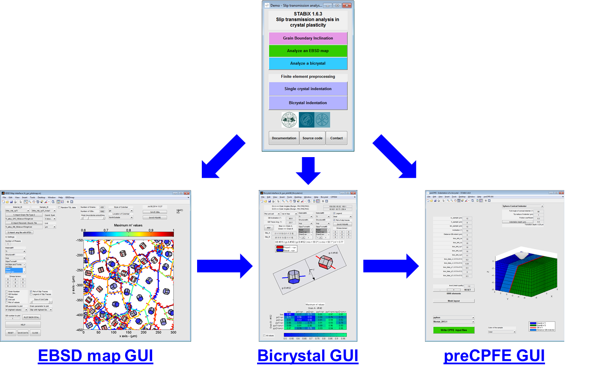

Getting started
===============

.. include:: includes.rst

Source Code
***************

.. include:: source_code.rst

README and demo.m
********************

To have more details about the use of the toolbox, please have a look to :

.. code-block:: matlab

   README.txt

Then, run the following |matlab| script and answer 'y' or 'yes' to add path to the |matlab| search paths :

.. code-block:: matlab

   path_management.m

The GUIs
**********

Run one of these GUIs to play with the toolbox.

.. csv-table::
   :header: "|matlab| function", "Features", "YAML config. file"
   :widths: 25, 25, 25
  
   `demo <https://github.com/stabix/stabix/blob/master/demo.m>`_, "Start and run other GUIs." 
   `EBSD map GUI <https://github.com/stabix/stabix/blob/master/gui_ebsd_map/A_gui_plotmap.m>`_, "Analysis of slip transmission across GBs for an EBSD map.", `config_gui_EBSDmap_defaults.yaml <https://github.com/stabix/stabix/blob/master/YAML_config_files/config_gui_EBSDmap_defaults.yaml>`_
   `Bicrystal GUI <https://github.com/stabix/stabix/blob/master/gui_bicrystal/A_gui_plotGB_Bicrystal.m>`_, "Analysis of slip transfer in a bicrystal." 
   `preCPFE_SX <https://github.com/stabix/stabix/blob/master/gui_preCPFE/A_preCPFE_windows_indentation_setting_SX.m>`_, "Preprocess of CPFE model for SX indentation.", `config_CPFEM_defaults.yaml <https://github.com/stabix/stabix/blob/master/YAML_config_files/config_CPFEM_defaults.yaml>`_
   `preCPFE_BX <https://github.com/stabix/stabix/blob/master/gui_preCPFE/A_preCPFE_windows_indentation_setting_BX.m>`_, "Preprocess of CPFE model for BX indentation.", `config_CPFEM_defaults.yaml <https://github.com/stabix/stabix/blob/master/YAML_config_files/config_CPFEM_defaults.yaml>`_
   `GBinc <https://github.com/stabix/stabix/blob/master/gui_gbinc/A_gui_gbinc.m>`_, "Calculation of grain boundaries inclination." 
   

   
   *Figure 1 : The different GUIs of the STABiX toolbox.*
   
The YAML configuration files
*******************************

Default YAML configuration files, stored in the folder `YAML_config_files <https://github.com/stabix/stabix/tree/master/YAML_config_files>`_, are loaded automatically to set the GUIs:

* `config.yaml <https://github.com/stabix/stabix/blob/master/YAML_config_files/config.yaml>`_
* `config_CPFEM_defaults.yaml <https://github.com/stabix/stabix/blob/master/YAML_config_files/config_CPFEM_defaults.yaml>`_
* `config_CPFEM_material_defaults.yaml <https://github.com/stabix/stabix/blob/master/YAML_config_files/config_CPFEM_material_defaults.yaml>`_
* `config_CPFEM_materialA_defaults.yaml <https://github.com/stabix/stabix/blob/master/YAML_config_files/config_CPFEM_materialA_defaults.yaml>`_
* `config_CPFEM_materialB_defaults.yaml <https://github.com/stabix/stabix/blob/master/YAML_config_files/config_CPFEM_materialB_defaults.yaml>`_
* `config_gui_EBSDmap_defaults.yaml <https://github.com/stabix/stabix/blob/master/YAML_config_files/config_gui_EBSDmap_defaults.yaml>`_
* `config_gui_BX_defaults.yaml <https://github.com/stabix/stabix/blob/master/YAML_config_files/config_gui_BX_defaults.yaml>`_
* `config_gui_SX_defaults.yaml <https://github.com/stabix/stabix/blob/master/YAML_config_files/config_gui_SX_defaults.yaml>`_
* `config_mesh_BX_defaults.yaml <https://github.com/stabix/stabix/blob/master/YAML_config_files/config_mesh_BX_defaults.yaml>`_
* `config_mesh_SX_defaults.yaml <https://github.com/stabix/stabix/blob/master/YAML_config_files/config_mesh_SX_defaults.yaml>`_
   
You have to set your own YAML configuration files, by following instructions given in this `README <https://github.com/stabix/stabix/blob/master/YAML_config_files/README.txt>`_.

`Visit the YAML website for more informations <http://www.yaml.org/>`_.

`Visit the YAML code for Matlab <http://code.google.com/p/yamlmatlab/>`_.

MTEX toolbox
****************

For some options and functions implemented in the STABiX toolbox, you have to download and install the `MTEX Toolbox <http://mtex-toolbox.github.io/>`_.

OpenGL
*********

If the OpenGL rendering is not satisfying, you can modify the corresponding option in the `config.yaml <https://github.com/stabix/stabix/blob/master/YAML_config_files/config.yaml>`_ file.

`Visit the Matlab page about OpenGL rendering <http://fr.mathworks.com/help/matlab/ref/opengl.html?refresh=true>`_.