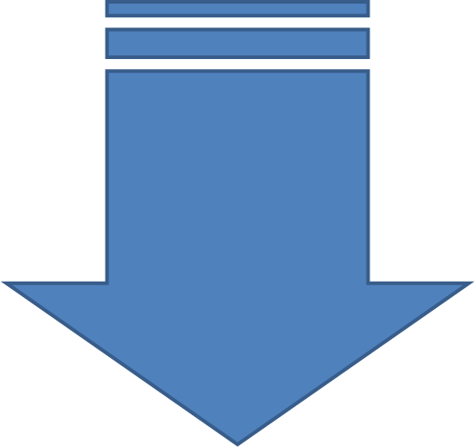

.. MWN2_matlab documentation master file, created by
   sphinx-quickstart on Fri Apr 04 20:28:37 2014.
   You can adapt this file completely to your liking, but it should at least
   contain the root `toctree` directive.
   

..  |matlab| replace:: Matlab\ :sup:`TM` \

Slip Transmission |matlab| toolbox
==================================

.. only:: html

    .. figure:: ./_pictures/GUIs/STABiX_ebsdmap.gif
        :scale: 100 %
        :align: right
        
        *Slip transmission analysis for an EBSD map of cp alpha-Ti.*
   
.. only:: latex

    .. figure:: ./_pictures/GUIs/EBSD_map.png
        :scale: 40 %
        :align: right
        
        *Slip transmission analysis for an EBSD map of near alpha phase Ti alloy.*
   
The |matlab| toolbox **STABiX** provides a unique and simple way to analyse slip transmission in a bicrystal.
Graphical User Interfaces (GUIs) are implemented in order to import EBSD results, and to represent and quantify grain boundary slip resistance.
Key parameters, such as the number of phases, crystal structure (fcc, bcc, or hcp), and slip families for calculations, are set by the user.
With this information, grain boundaries are plotted and color coded according to the :math:`m'` factor [#LusterMorris_1995]_ that quantifies the geometrical
compatibility of the slip planes normals and Burgers vectors of incoming and outgoing slip systems.
Other potential functions that could assess the potential to develop damage are implemented (e.g. residual Burgers vector
[#Marcinkowski_1970]_ and [#Bollmann_1970]_, :math:`N` factor [#LivingstonChalmers_1957]_, resolved shear stress [#Bieler_2009]_, misorientation...).

Furthermore, the GUI provides the possibility to plot and analyze the case of a bicrystal, and to model sphero-conical indentation performed
close to grain boundaries (i.e. quasi bicrystal deformation).
All of the data linked to the bicrystal indentation (indenter properties, indentation settings, grain boundary inclination, etc.) are collected through the GUI.
A python\ :sup:`TM` \ file can be then exported in order to carry out a fully automatic 3D crystal plasticity finite element simulations of the indentation process
using one of the constitutive models available in DAMASK [#Roters_2010]_ and [#DAMASK]_.
The plasticity of single crystals is quantified by a combination of crystal lattice orientation mapping,
instrumented sphero-conical indentation, and measurement of the resulting surface topography [#Zambaldi_2012]_ and [#Zambaldi_SX]_.
In this way the stress and strain fields close to the grain boundary can be rapidly assessed.
Activation and transmission of slip are interpreted based on these simulations and the mechanical resistance of grain boundaries can be quantified.

   
`Source code is hosted at Github <https://github.com/stabix/stabix>`_.

`Find here the reference paper for this toolbox <http://dx.doi.org/10.5281/zenodo.11561>`_.

Contents
========
   
.. toctree::
   :maxdepth: 3
   
   motivation
   getting_started
   bicrystal_definition
   slip_transmission_toolbox
   experimental_data
   ebsd_map_gui
   bicrystal_gui
   preCPFE_gui
   data_from_paper
   readme_link
   
References
==========
.. [#LusterMorris_1995] `J. Luster and M.A. Morris, "Compatibility of deformation in two-phase Ti-Al alloys: Dependence on microstructure and orientation relationships.", Metal. and Mat. Trans. A (1995), 26(7), pp. 1745-1756. <http://dx.doi.org/10.1007/BF02670762>`_
.. [#Marcinkowski_1970] `M.J. Marcinkowski and W.F. Tseng, "Dislocation behavior at tilt boundaries of infinite extent.", Metal. Trans. (1970), 1(12), pp. 3397-3401. <http://dx.doi.org/10.1007/BF03037870>`_
.. [#Bollmann_1970] `W. Bollmann, "Crystal Defects and Crystalline Interfaces", Springer-Verlag (1970). <http://dx.doi.org/10.1007/978-3-642-49173-3>`_
.. [#LivingstonChalmers_1957] `J.D. Livingston and B. Chalmers, "Multiple slip in bicrystal deformation.", Acta Metallurgica (1957), 5(6), pp. 322-327. <http://dx.doi.org/10.1016/0001-6160(57)90044-5>`_
.. [#Bieler_2009] `T.R. Bieler et al., "The role of heterogeneous deformation on damage nucleation at grain boundaries in single phase metals.", Int. J. of Plast. (2009), 25(9), pp. 1655–1683. <http://dx.doi.org/10.1016/j.ijplas.2008.09.002>`_
.. [#Roters_2010] `F. Roters et al., "Overview of constitutive laws, kinematics, homogenization and multiscale methods in crystal plasticity finite-element modeling: Theory, experiments, applications.",  Acta Materialia (2010), 58(4), pp. 1152-1211. <http://dx.doi.org/10.1016/j.actamat.2009.10.058>`_
.. [#DAMASK] `DAMASK — the Düsseldorf Advanced Material Simulation Kit. <http://damask.mpie.de/>`_
.. [#Zambaldi_2012] `C. Zambaldi et al., "Orientation informed nanoindentation of α-titanium: Indentation pileup in hexagonal metals deforming by prismatic slip", J. Mater. Res. (2012), 27(01), pp. 356-367. <http://dx.doi.org/10.1557/jmr.2011.334>`_
.. [#Zambaldi_SX] `C. Zambaldi, "Anisotropic indentation pile-up in single crystals". <http://zambaldi.de/sx-indent/>`_

Contact
=======
:Authors: `David Mercier <d.mercier@mpie.de>`_ [1], `Claudio Zambaldi <c.zambaldi@mpie.de>`_ [1] and `Thomas R. Bieler <bieler@egr.msu.edu>`_ [2].

[1] `Max-Planck-Institut für Eisenforschung, 40237 Düsseldorf, Germany <http://www.mpie.de/>`_

[2] `Chemical Engineering and Materials Science, Michigan State University, East Lansing 48824 MI, USA <http://www.msu.edu/>`_

.. image:: ./_pictures/logo_MPIE_MSU.png
   :scale: 50 %

Acknowledgements
================
This work was supported by the DFG/NSF `Materials World Network <http://www.nsf.gov/funding/pgm_summ.jsp?pims_id=12820>`_ grant references (DFG ZA 523/3-1 and NSF-DMR-1108211).

The authors are grateful to Philip Eisenlohr, Martin Crimp and Yang Su of `Michigan State University <http://www.msu.edu/>`_,
and the `Max-Planck-Institut für Eisenforschung <http://www.mpie.de/>`_ for support.

.. include:: contributors.rst

Keywords
========
|matlab| Toolbox; Graphical User Interface (GUI); Grain Boundary (GB); Polycrystalline Metals; Slip Transmission; Bi-Crystal (BX);
Electron backscatter diffraction (EBSD); Instrumented indentation; Crystal Plasticity Finite Element Method (CPFEM); python\ :sup:`TM` \ Toolbox.
