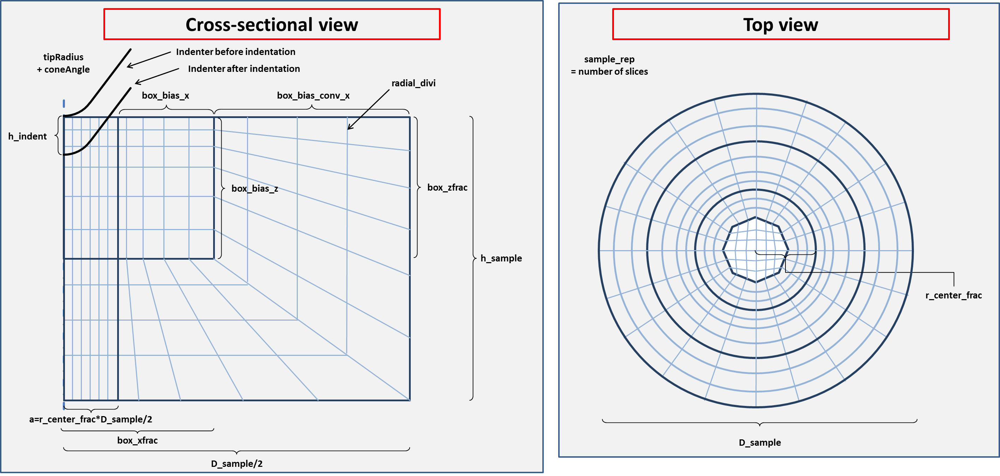
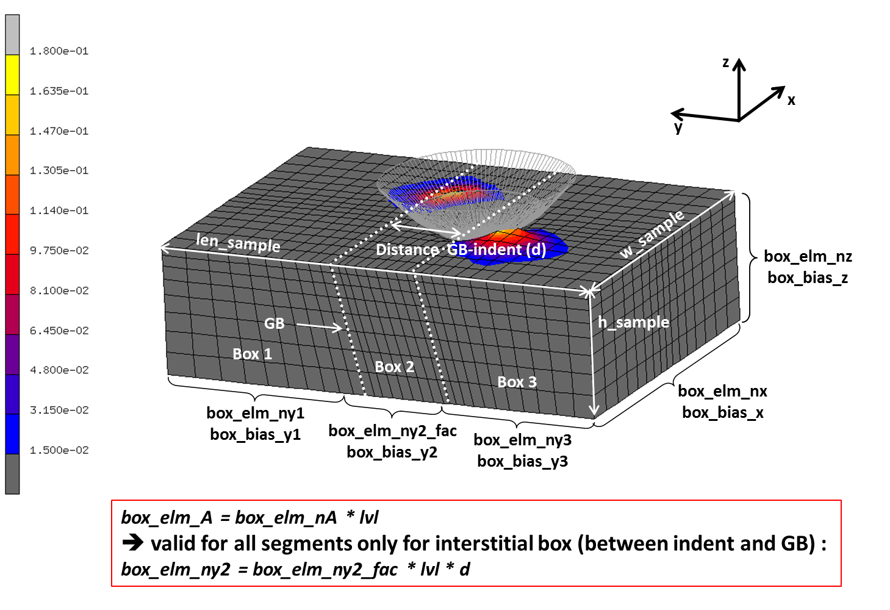

CPFE simulation preprocessing GUIs
===================================

.. include:: includes.rst

The *preCPFE* GUIs can rapidly transfer the experimental data into 
crystal plasticity finite element (CPFE) simulation input files. 
The types of input files are:

    * scripts to generate the finite element models in *MSC.Mentat* (2008 to 2014) (*procedure* file format) 
      or *Abaqus* (6.12 to 6.14) (Python script) based on the experimental data and test geometry;
    * the crystallographic orientations from the experimental data sets;
    * material parameter files for the subroutines that implement the constitutive model.

A parametrized visualization of the bicrystal indentation model through the GUI 
allows tuning the geometry and finite element discretization and the size of the 
sample and the indenter.

Currently the following models can be written:

    * :ref:`single_crystal_indentation` (MSC.Mentat and Abaqus)
    * :ref:`bicrystal_indentation` (MSC.Mentat and Abaqus)
    * :ref:`scratch_test` (MSC.Mentat and Abaqus)
    
Please find here the `Python package used to generate the SX and BX indentation models
<https://github.com/stabix/stabix/tree/master/third_party_code/python>`_.

How to load crystallographic properties of the SX or of the BX?
------------------------------------------------------------------

It is possible to set SX or BX properties (material, phase, Euler angles, trace angle...) :

- from the `Bicrystal GUI <http://stabix.readthedocs.org/en/latest/bicrystal_gui.html>`_ 
  (by giving GB's number and pressing the button 'PLOT BICRYSTAL');

- from a YAML configuration file (from the menu, by clicking on 'preCPFE-SX' or
  'preCPFE-BX', and 'Load Single Crystal config. file' or 'Load Bicrystal config. file').

.. figure:: ./_pictures/gui/bicrystal2cpfem.png
   :scale: 50 %
   :align: center
   
   *The different steps to set the preCPFE GUIs.*

.. _single_crystal_indentation:

Single crystal (SX) indentation
--------------------------------

Analysis of the orientation dependent pile-up topographies that are formed during 
single crystal indentation provides insight into the operating deformation mechanisms.
CPFE simulation of single crystal indentation has an important role in clarifying
the influence of the single-slip behaviour of different slip systems on the resulting 
surface profiles.

The function used to run the preCPFE GUI for SX indentation is :
`A_preCPFE_windows_indentation_setting_SX.m
<https://github.com/stabix/stabix/tree/master/gui_preCPFE/A_preCPFE_windows_indentation_setting_SX.m>`_

.. figure:: ./_pictures/gui/preCPFE_GUI_SX.png
   :scale: 40 %
   :align: center
   
   *Screenshot of the preCPFE GUI for the single crystal indentation*
   
.. figure:: ./_pictures/fem_models/abaqus_SX_model.png
   :scale: 40 %
   :align: center
   
   *Screenshot of the single crystal indentation model in Abaqus.*

Convention for the single crystal mesh
***************************************

   
   *Convention used to define the single crystal mesh.*

.. _bicrystal_indentation:

Bicrystal (BX) indentation
---------------------------

CPFE simulation of indentation close to grain boundaries can provide a good approximation 
of the local micromechanics in this experiment.
While models that take into account the micromechanical effect of the boundary 
are the subject of ongoing research, most geometrical and kinematic factors are taken into account
by employing a local phenomenological crystal plasticity formulation in the simulations.

The function used to run the preCPFE GUI for BX indentation is:
`A_preCPFE_windows_indentation_setting_BX.m
<https://github.com/stabix/stabix/tree/master/gui_preCPFE/A_preCPFE_windows_indentation_setting_BX.m>`_

.. figure:: ./_pictures/gui/preCPFE_GUI_BX.png
   :scale: 40 %
   :align: center
   
   *Screenshot of the preCPFE GUI for the bicrystal indentation.*

Convention for the bicrystal mesh
**********************************

   
   *Convention used to define the bicrystal mesh.*

.. _scratch_test:

Scratch test on SX and BX
--------------------------

CPFE simulation of scratch test in a single crystal or close to a grain boundary is implemented into this GUI.
Scratch length and scratch direction have to be set by the user.

.. figure:: ./_pictures/gui/preCPFE_GUI_scratch.png
   :scale: 40 %
   :align: center
   
   *Screenshot of the preCPFE GUI for the scratch test.*

Indenter's geometry
--------------------

Currently the following geometries can be used for CPFE simulations :
    * `cono-spherical indenter <https://github.com/stabix/stabix/blob/master/gui_preCPFE/preCPFE_3d_conospherical_indenter.m>`_ ;
    * `Berkovich indenter <https://github.com/stabix/stabix/blob/master/gui_preCPFE/preCPFE_3d_polygon_indenter.m>`_ ;
    * `Vickers indenter <https://github.com/stabix/stabix/blob/master/gui_preCPFE/preCPFE_3d_polygon_indenter.m>`_ ;
    * `cube corner indenter <https://github.com/stabix/stabix/blob/master/gui_preCPFE/preCPFE_3d_polygon_indenter.m>`_ ;
    * `flat punch <https://github.com/stabix/stabix/blob/master/gui_preCPFE/preCPFE_3d_flat_punch_indenter.m>`_ ;
    * `free topography <https://github.com/stabix/stabix/blob/master/gui_preCPFE/preCPFE_3d_indenter_topo_AFM.m>`_ (from an AFM measurement for instance).
    
For the Berkovich, Vickers, cube corner indenters and the free topography,
the faces and vertices are saved in a structure variable from a patch object.
For the cono-spherical and the flat punch, geometries are already implemented
in the Python package for *MSC.Mentat* and *Abaqus*.
It is possible as well to call the |matlab| function `surf2patch
<http://www.mathworks.fr/help/matlab/ref/surf2patch.html>`_, to return
the faces and vertices from a surface object.

Then the function `patch2inp <https://github.com/stabix/stabix/blob/master/util/patch2inp.m>`_
is used to generate an *Abaqus .inp* file, which is used
when the CPFE model is created in *MSC.Mentat* or *Abaqus*.

It is possible to rotate directly into the GUIs, the Berkovich, Vickers,
cube corner indenters and the free topography before the generation
of the *Abaqus .inp* file.

.. only:: html

    .. figure:: ./_pictures/gui/BX_Berko_rotate.gif
       :scale: 40 %
       :align: center
       
       *Screenshots of the preCPFE GUI for the bicrystal indentation with Berkovich indenter.*
   
.. only:: latex

    .. figure:: ./_pictures/gui/BX_Berko_rotate.png
       :scale: 40 %
       :align: center
       
       *Screenshot of the preCPFE GUI for the bicrystal indentation with Berkovich indenter.*
    
AFM topography
***************

The topography from an Atomic Force Microscopy (AFM) measurement has to be saved into a .txt file in the *Gwyddion ASCII* format.

The |matlab| function used to load and read Gwyddion file is : 
`read_gwyddion_ascii.m <https://github.com/stabix/stabix/blob/master/gwyddion/read_gwyddion_ascii.m>`_

`Visit the Gwyddion website for more information. <http://gwyddion.net/>`_

.. figure:: ./_pictures/gui/preCPFE_GUI_BX_AFM_topo_indenter.png
   :scale: 40 %
   :align: center
   
   *Screenshot of the preCPFE GUI for the bicrystal indentation with loaded AFM topography of the indenter.*

Contact definition
-------------------

* *MSC.Mentat*
    - The indenter is modeled by a rigid body and the sample by a deformable body.
    - Contact is defined by a bilinear Coulomb friction model.

* *Abaqus*
    - The indenter is modeled by a rigid body and the sample by a deformable body.
    - The external surface of the indenter is defined as the "master" region.
    - The top surface of the (multilayer) sample is defined as the "slave" region.
    - If the coefficient friction is different from 0, the classical isotropic Coulomb friction model is used to define the contact between the indenter and the sample.
    - If the coefficient friction is set to 0, the contact is defined by a frictionless tangential behavior and a hard normal behavior.

A friction coefficient of 0.3 is set by default for every CPFE simulation.
It is possible to modify this parameter, by changing its value in the *preCPFE* GUIs.
    
Mesh definition
-------------------

* *MSC.Mentat*
    - The mesh is defined by default by hexahedral eightnode elements (hex8).

* *Abaqus*
    - The mesh is defined by default by linear hexahedral eightnode elements (C3D8).
    - It is possible to set quadratic elements (e.g.: C3D20), by changing in the python code the value of the "linear_elements" variable from 1 to 0.

.. note::
    `Note that DAMASK incorporates a limited number of different types of element geometries. <http://damask.mpie.de/Documentation/ElementType>`_
    For a detailed information about the characteristics of each element refer to MSC.Marc and Abaqus user's manuals.

Python setup
-------------

For the generation of the CPFE preprocessing scripts an installation of Python 
is required together with the *Numpy 1.10.4* ans *Scipy 0.16.0* packages.
Often one of the `scientific Python distributions <http://www.scipy.org/install.html#scientific-python-distributions>`_
is the easiest way to get up and running (use a Python 2.x distribution).
To make sure that |stabix| can find the installed Python you will have to either 
put it on the system's `PATH <http://en.wikipedia.org/wiki/PATH_%28variable%29>`_
or put it's exact location in the user configuration as detailed below.

Adjusting the configuration settings 
-------------------------------------

To write out the necessary files for finite element simulations it is likely that 
the user wants to adjust some settings such as the used python installation or the 
path where the files are written to. 
This can be achieved in the custom menu of the preCPFE GUis : ``Edit CPFEM config file``.
A user specific copy of the default configuration YAML file is created and 
opened in the |matlab| editor. 
To benefit from later changes in the default settings, all
configuration parameters that are not specific to the user's setup should be deleted 
from the user's CPFE configuration file.

Installing DAMASK
------------------

For instructions on how to set up the DAMASK constitutive simulation code please visit
http://DAMASK.mpie.de.

Writing the CPFE input files
-----------------------------

After everything is configured and the model geometry and discretization is optimized, 
all necessary files to run a CPFE simulation can be generated by pressing the green button. 
All information will be written to a newly created folder which also includes a timestamp
for later reference.

Input files
------------

* *MSC.Mentat*
    - a procedure file containing the FEM model (\*.proc)
    - a Python file containing parameters for FEM model (\*.mat_FEM_model_parameters.py)
    - a Python file containing material configuration (\*.mat_DAMASK_materialconfig.py)
    - a MAT-file (binary |matlab| format file) storing |matlab| workspace variables(\*.mat)
    - a material configuration file (material.config)
    - an input file for specific indenter's geometry (\*.inp) (optional)

* *Abaqus*
    - a Python file containing the FEM model (\*.py)
    - a Python file containing parameters for FEM model (\*.mat_FEM_model_parameters.py)
    - a Python file containing material configuration (\*.mat_DAMASK_materialconfig.py)
    - a MAT-file (binary |matlab| format file) storing |matlab| workspace variables(\*.mat)
    - a material configuration file (material.config)
    - an input file for specific indenter's geometry (\*.inp) (optional)

Using the CPFE input files
-----------------------------

* *MSC.Mentat 'classic interface'*
    - 'Files' ==> 'Current Directory' ==> Select the folder containing input files
    - 'Utils' ==> 'Procedures' ==> Select procedure file containing the FEM model (\*.proc)

* *MSC.Mentat 'new interface (> 2012)'*
    - 'Files' ==> 'Current Directory' ==> Select the folder containing input files
    - 'Tools' ==> 'Procedures' ==> Select procedure file containing the FEM model (\*.proc)

* *Abaqus*
    - 'File' ==> 'Set Work Directory...' ==> Select the folder containing input files
    - 'File' ==> 'Run Script' ==> Select the Python file containing the FEM model (\*.py)
    
Running a job with DAMASK
---------------------------

* *MSC.Mentat*
    - In the JOB RUN menu choose USER SUBROUTINE FILE and select the interface routine DAMASK_marc.f90.

Find the full documentation for the use of DAMASK with Marc here : http://damask.mpie.de/Usage/Marc.

* *Abaqus*
    - In the Job Manager > Create... specify the User subroutine file (either DAMASK_abaqus_std.f or DAMASK_abaqus_exp.f).

Find the full documentation for the use of DAMASK with Abaqus here : http://damask.mpie.de/Usage/Abaqus.

.. note::
    For Abaqus, you may have to modify the extension of the subroutine:
        - .f if the operating environment is Linux;
        - .for if the operating environment is Windows.

See also
----------

`Wang Y. et al., "Orientation dependence of nanoindentation pile-up patterns and of nanoindentation microtextures in copper single crystals", Acta Materialia (2004). <https://doi.org/10.1016/j.actamat.2004.01.016>`_

`Liu Y. et al., "Combined numerical simulation and nanoindentation for determining mechanical properties of single crystal copper at mesoscale", Journal of the Mechanics and Physics of Solids (2005). <https://doi.org/10.1016/j.jmps.2005.07.003>`_

`Zaafarani N. et al., "Three-dimensional investigation of the texture and microstructure below a nanoindent in a Cu single crystal using 3D EBSD and crystal plasticity finite element simulations", Acta Materialia (2006). <https://doi.org/10.1016/j.actamat.2005.12.014>`_

`Zambaldi C. et al., "Modeling and experiments on the indentation deformation and recrystallization of a single-crystal nickel-base superalloy", Materials Science and Engineering A (2007). <https://doi.org/10.1016/j.msea.2006.11.068>`_

`Liu Y. et al., "Orientation effects in nanoindentation of single crystal copper", International Journal of Plasticity (2008). <https://doi.org/10.1016/j.ijplas.2008.02.009>`_

`Zaafarani N. et al., "On the origin of deformation-induced rotation patterns below nanoindents", Acta Materialia (2008). <https://doi.org/10.1016/j.actamat.2007.09.001>`_

`Casals O. and Forest S., "Finite element crystal plasticity analysis of spherical indentation in bulk single crystals and coatings", Computational Materials Science (2009). <https://doi.org/10.1016/j.commatsci.2008.09.030>`_

`Gerday A. F. et al., "Interests and limitations of nanoindentation for bulk multiphase material identification: Application to the β phase of Ti-5553", Acta Materialia (2009). <https://doi.org/10.1016/j.actamat.2009.07.020>`_ 

`Britton T.B. et al., "The effect of crystal orientation on the indentation response of commercially pure titanium: experiments and simulations", Proc. R. Soc. A (2010). <https://doi.org/10.1098/rspa.2009.0455>`_

`Chang H.-J. et al., "Multiscale modelling of indentation in FCC metals: From atomic to continuum", C. R. Physique (2010). <https://doi.org/10.1016/j.crhy.2010.07.007>`_

`Zambaldi C. and Raabe D., "Crystal plasticity modelling and experiments for deriving microstructure-property relationships in γ-TiAl based alloys", Journal of Physics (2010). <https://doi.org/10.1088/1742-6596/240/1/012140>`_

`Zambaldi C., "Micromechanical modeling of γ-TiAl based alloys", PhD Thesis (2010). <https://doi.org/10.2370/9783832297176>`_

`Zambaldi C. and Raabe D., "Plastic anisotropy of c-TiAl revealed by axisymmetric indentation", Acta Materialia (2011). <https://doi.org/10.1016/j.actamat.2010.02.025>`_

`Vu-Hoang S. et al., "Crystal Plasticity of Single Crystal and Film on Substrate Probed by Nano-lndentation: Simulations and Experiments", Mater. Res. Soc. Symp. Proc. (2011). <https://doi.org/10.1557/opl.2011.1510>`_

`Eidel B., "Crystal plasticity finite-element analysis versus experimental results of pyramidal indentation into (001) fcc single crystal", Acta Materialia (2011). <https://doi.org/10.1016/j.actamat.2010.11.042>`_

`Zambaldi C. et al., "Orientation informed nanoindentation of a-titanium: Indentation pileup in hexagonal metals deforming by prismatic slip", J. Mater. Res. (2012). <https://doi.org/10.1557/jmr.2011.334>`_

`Zahedi A. et al., "Indentation in f.c.c. single crystals", Solid State Phenomena (2012). <https://doi.org/10.4028/www.scientific.net/SSP.188.219>`_

`Liu M. et al., "Crystal Plasticity Study of the Effect of the Initial Orientation on the Indentation Surface Profile Patterns and Micro-Textures of Aluminum Single Crystal", Advances in Materials and Processing Technologies (2013). <https://doi.org/10.1002/srin.201300011>`_

`Han F. et al., "Experiments and crystal plasticity finite element simulations of nanoindentation on Ti-6Al-4 V alloy", Materials Science & Engineering A (2014). <https://doi.org/10.1016/j.msea.2014.11.090>`_

`Choudhury S.F. et al., "Single Crystal Plasticity Finite Element Analysis of Cu6Sn5 Intermetallic", Metall. and Mat. Trans. A (2014). <https://doi.org/10.1007/s11661-014-2696-0>`_

`González D. et al., "Numerical analysis of the indentation size effect using a strain gradient crystal plasticity model", Computational Materials Science (2014). <https://doi.org/10.1016/j.commatsci.2013.10.004>`_

`Esqué-de los Ojos D. et al., "Sharp indentation crystal plasticity finite element simulations: Assessment of crystallographic anisotropy effects on the mechanical response of thin fcc single crystalline films", Computational Materials Science (2014). <https://doi.org/10.1016/j.commatsci.2014.01.064>`_

`Kitahara H. et al., "Anisotropic deformation induced by spherical indentation of pure Mg single crystals", Acta Materialia (2014). <https://doi.org/10.1016/j.actamat.2014.06.039>`_

`Kucharski S. et al., "Surface Pile-Up Patterns in Indentation Testing of Cu Single Crystals", Experimental Mechanics (2014). <https://doi.org/10.1007/s11340-014-9883-1>`_

`Liu M. et al., "A crystal plasticity study of the effect of friction on the evolution of texture and mechanical behaviour in the nano-indentation of an aluminium single crystal", Computational Materials Science (2014). <https://doi.org/10.1016/j.commatsci.2013.05.030>`_

`Yao W.Z. et al., "Plastic material parameters and plastic anisotropy of tungsten single crystal: a spherical micro-indentation study", J. Mater. Sci. (2014). <https://doi.org/10.1007/s10853-014-8080-z>`_

`Charleux L., "Abapy Documentation". <http://abapy.readthedocs.org/en/latest/index.html>`_

`Zambaldi C. et al., "Orientation dependent deformation by slip and twinning in magnesium during single crystal indentation", Acta Materialia (2015). <https://doi.org/10.1016/j.actamat.2015.01.046>`_

`Sánchez-Martín R. et al., "High temperature deformation mechanisms in pure magnesium studied by nanoindentation", Scripta Materialia (2015). <https://doi.org/10.1016/j.scriptamat.2015.03.012>`_

`Mao L. et al., "Explore the anisotropic indentation pile-up patterns of single-crystal coppers by crystal plasticity finite element modelling", Materials Letters (2015). <https://doi.org/10.1016/j.matlet.2015.08.093>`_

`Mao L. et al., "Crystal plasticity FEM study of nanoindentation behaviors
of Cu bicrystals and Cu–Al bicrystals", J. Mater. Res., (2015). <https://doi.org/10.1557/jmr.2015.223>`_

`Renner E. et al., "Sensitivity of the residual topography to single crystal plasticity parameters in Berkovich nanoindentation on FCC nickel", International Journal of Plasticity, (2015). <https://doi.org/10.1016/j.ijplas.2015.10.002>`_

`Juran P. et al., "Investigation of indentation-, impact- and scratch-induced mechanically affected zones in a copper single crystal", Comptes Rendus Mécanique, (2015). <https://doi.org/10.1016/j.crme.2015.03.003>`_

`Materna A. et al., "A Numerical Investigation of the Effect of Cubic Crystals Orientation on the Indentation Modulus", Acta Physica Polonica A, (2015). <https://doi.org/10.12693/APhysPolA.128.693>`_

`Csanádi T. et al., "Nanoindentation induced deformation anisotropy in β-Si3N4 ceramic crystals", Journal of the European Ceramic Society, (2015). <https://doi.org/10.1016/j.jeurceramsoc.2015.11.028>`_

`Liu M. et al., "A combined experimental-numerical approach for determining mechanical properties of aluminum subjects to nanoindentation", Scientific Reports, (2015). <https://doi.org/10.1038/srep15072>`_

`Su Y. et al., "Quantifying deformation processes near grain boundaries in α titanium using nanoindentation and crystal plasticity modeling", International Journal of Plasticity, (2016). <https://doi.org/10.1016/j.ijplas.2016.08.007>`_

`Weaver J.S. et al., "On capturing the grain-scale elastic and plastic anisotropy of alpha-Ti with spherical nanoindentation and electron back-scattered diffraction", Acta Materialia, (2016). <https://doi.org/10.1016/j.actamat.2016.06.053>`_

`Han F. et al., "Indentation Pileup Behavior of Ti-6Al-4V Alloy: Experiments and Nonlocal Crystal Plasticity Finite Element Simulations", Metallurgical and Materials Transactions A, (2017). <https://doi.org/10.1007/s11661-016-3946-0>`_

`Chakraborty A. and Eisenlohr P., "Evaluation of an inverse methodology for estimating constitutive parameters in face-centered cubic materials from single crystal indentations", European Journal of Mechanics - A/Solids, (2017). <https://doi.org/10.1016/j.euromechsol.2017.06.012>`_

`Zhao Z. et al., "Temperature dependent constitutive parameters from nanoindentation", poster for Chems Forum 2019, MSU.
