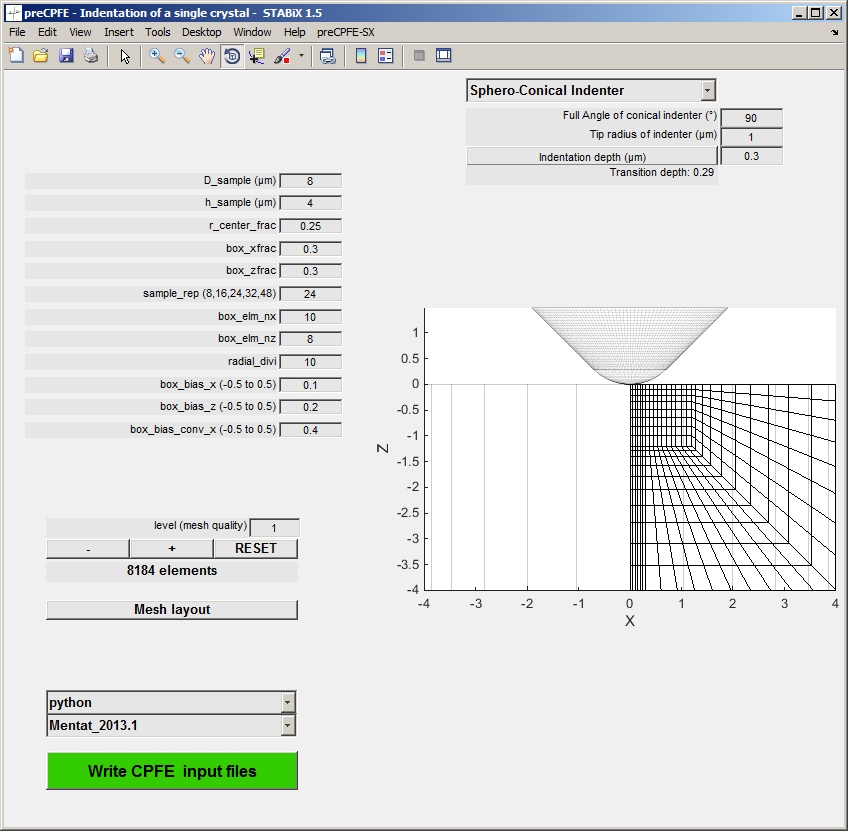
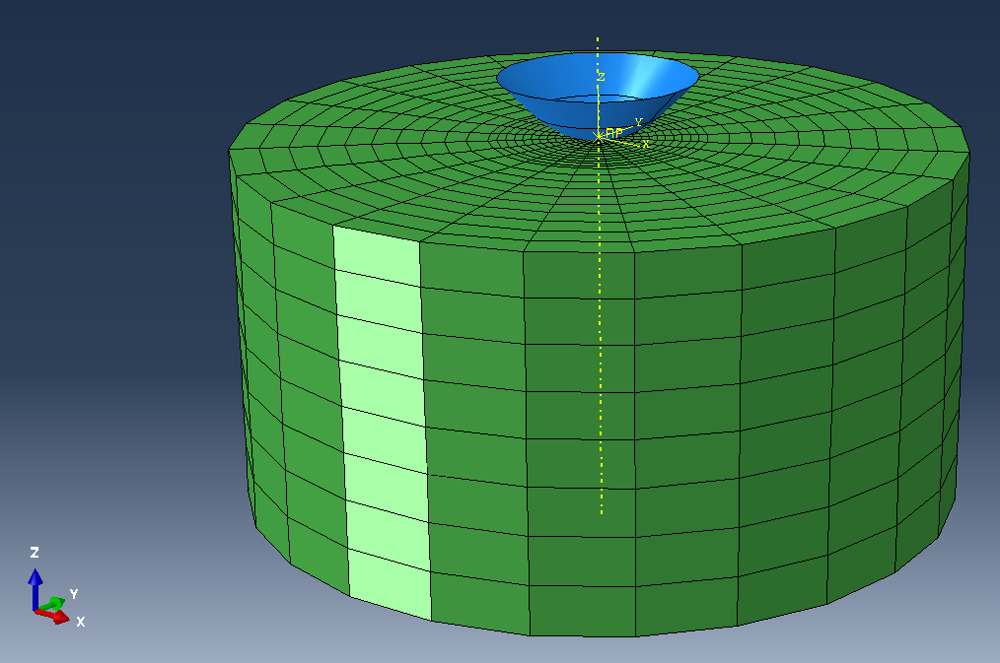
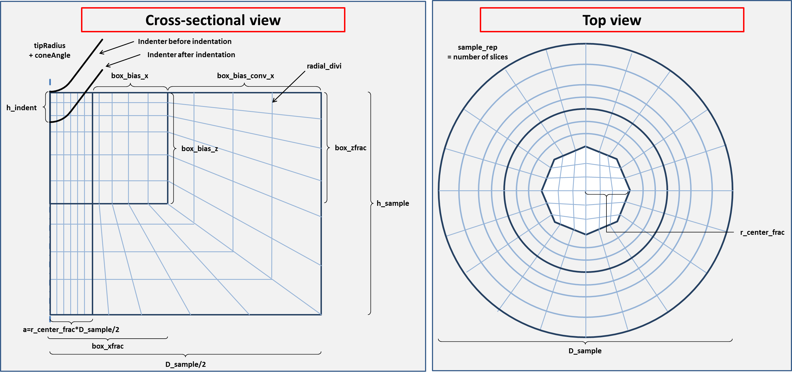
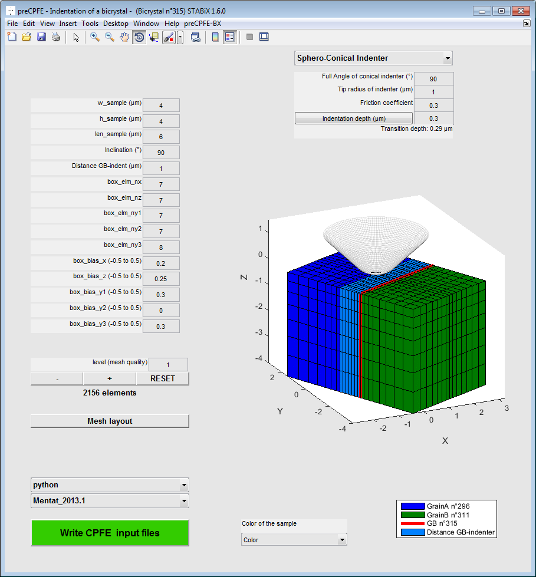
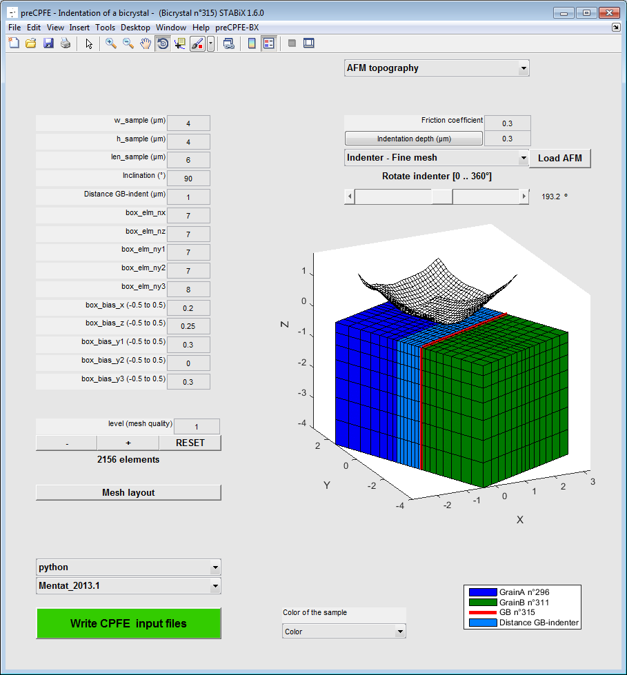

CPFE simulation preprocessing GUIs
===================================

.. include:: includes.rst

The *preCPFE* GUIs can rapidly transfer the experimental data into 
crystal plasticity finite element (CPFE) simulation input files. 
The types of input files are :

    * scripts to generate the finite element models in *MSC.Mentat* (*procedure* file format) 
      or *Abaqus* (Python script) based on the experimental data and test geometry ;
    * the crystallographic orientations from the experimental data sets ;
    * material parameter files for the subroutines that implement the constitutive model.

A parametrized visualization of the bicrystal indentation model through the GUI 
allows tuning the geometry and finite element discretization and the size of the 
sample and the indenter.

Currently the following models can be written:

    * :ref:`single_crystal_indentation` (Mentat and Abaqus)
    * :ref:`bicrystal_indentation` (Mentat)
    
.. _single_crystal_indentation:

Single crystal (SX) indentation
--------------------------------

Analysis of the orientation dependent pile-up topographies that are formed during 
single crystal indentation provides insight into the operating deformation mechanisms.
CPFE simulation of single crystal indentation has an important role in clarifying
the influence of the single-slip behavior of different slip systems on the resulting 
surface profiles.

The function used to run the preCPFE GUI for SX indentation is: `A_preCPFE_windows_indentation_setting_SX.m <https://github.com/stabix/stabix/tree/master/gui_preCPFE/A_preCPFE_windows_indentation_setting_SX.m>`_

   
   *Figure 1 : Screenshot of the preCPFE GUI for the single crystal indentation*
   

   
   *Figure 2 : Screenshot of the single crystal indentation model in Abaqus*
   
Convention for the single crystal mesh
***************************************

   
   *Figure 3 : Convention used to define the single crystal mesh.*
   
.. _bicrystal_indentation:

Bicrystal (BX) indentation
---------------------------

CPFE simulation of indentation close to grain boundaries can provide a good approximation 
of the local micromechanics in this experiment.
While models that take into account the micromechanical effect of the boundary 
are the subject of ongoing research, most geometrical and kinematic factors are taken into account
by employing a local phenomenological crystal plasticity formulation in the simulations.

The function used to run the preCPFE GUI for BX indentation is: `A_preCPFE_windows_indentation_setting_BX.m <https://github.com/stabix/stabix/tree/master/gui_preCPFE/A_preCPFE_windows_indentation_setting_BX.m>`_

   
   *Figure 4 : Screenshot of the preCPFE GUI for the bicrystal indentation*

Convention for the bicrystal mesh
**********************************

.. figure:: ./_pictures/Schemes_SlipTransmission/BX_indentation_mesh_example.png
   :scale: 25 %
   :align: center
   
   *Figure 5 : Convention used to define the bicrystal mesh.*
   
Indenter's geometry
--------------------

Currently the following geometries can be used for CPFE simulations :

    * `cono-spherical indenter <https://github.com/stabix/stabix/blob/master/gui_preCPFE/preCPFE_3d_conospherical_indenter.m>`_ ;
    * `Berkovich indenter <https://github.com/stabix/stabix/blob/master/gui_preCPFE/preCPFE_3d_polygon_indenter.m>`_ ;
    * `Vickers indenter <https://github.com/stabix/stabix/blob/master/gui_preCPFE/preCPFE_3d_polygon_indenter.m>`_ ;
    * `cube corner indenter <https://github.com/stabix/stabix/blob/master/gui_preCPFE/preCPFE_3d_polygon_indenter.m>`_ ;
    * `flat punch <https://github.com/stabix/stabix/blob/master/gui_preCPFE/preCPFE_3d_flat_punch_indenter.m>`_ ;
    * `free topography <https://github.com/stabix/stabix/blob/master/gui_preCPFE/preCPFE_3d_indenter_topo_AFM.m>`_ (from an AFM measurement for instance).
    
For the Berkovich, Vickers, cube corner indenters and the free topography, the faces and vertices are saved in a structure variable from a patch object.
For the cono-spherical and the flat punch, geometries are already implemented in the Python package for *MSC.Mentat* and *Abaqus*.
It is possible as well to call the |matlab| function `surf2patch <http://www.mathworks.fr/help/matlab/ref/surf2patch.html>`_, to return the faces and vertices from a surface object.

Then the function `patch2inp <https://github.com/stabix/stabix/blob/master/util/patch2inp.m>`_
is used to generate an *Abaqus .inp* file, which is used when the CPFE model is created in *MSC.Mentat* or *Abaqus*.

It is possible to rotate directly into the GUIs, the Berkovich, Vickers, cube corner indenters and the free topography before the generation of the *Abaqus .inp* file.
    
AFM topography
***************

The topography from an AFM measurement has to be saved into a .txt file in the *Gwyddion ASCII* format.

The |matlab| function used to load and read Gwyddion file is: `read_gwyddion_ascii.m <https://github.com/stabix/stabix/blob/master/gwyddion/read_gwyddion_ascii.m>`_

`Visit the Gwyddion website for more information. <http://gwyddion.net/>`_

   
   *Figure 6 : Screenshot of the preCPFE GUI for the bicrystal indentation with loaded AFM topography of the indenter*

Python setup
-------------

For the generation of the CPFE preprocessing scripts an installation of Python 
is required together with the *Numpy* package.
Often one of the `scientific Python distributions <http://www.scipy.org/install.html#scientific-python-distributions>`_ is the easiest way to get up and running (use a Python 2.x distribution).
To make sure that |stabix| can find the installed Python you will have to either 
put it on the system's `PATH <http://en.wikipedia.org/wiki/PATH_%28variable%29>`_ or put it's exact location in the user configuration as detailed below.

Adjusting the configuration settings 
-------------------------------------

To write out the necessary files for finite element simulations it is likely that 
the user wants to adjust some settings such as the used python installation or the 
path where the files are written to. 
This can be achieved in the custom menu of the preCPFE GUIs: ``Edit CPFEM config file``.
A user specific copy of the default configuration YAML file is created and 
opened in the |matlab| editor. 
To benefit from later changes in the default settings, all
configuration parameters that are not specific to the user's setup should be deleted 
from the user's CPFE configuration file.

Installing DAMASK
------------------

For instructions on how to set up the DAMASK constitutive simulation code please visit
http://DAMASK.mpie.de .

Writing the CPFE input files
-----------------------------

After everything is configured and the model geometry and discretization is optimized, 
all necessary files to run a CPFE simulation can be generated by pressing the green button. 
All information will be written to a newly created folder which also includes a timestamp
for later reference.

