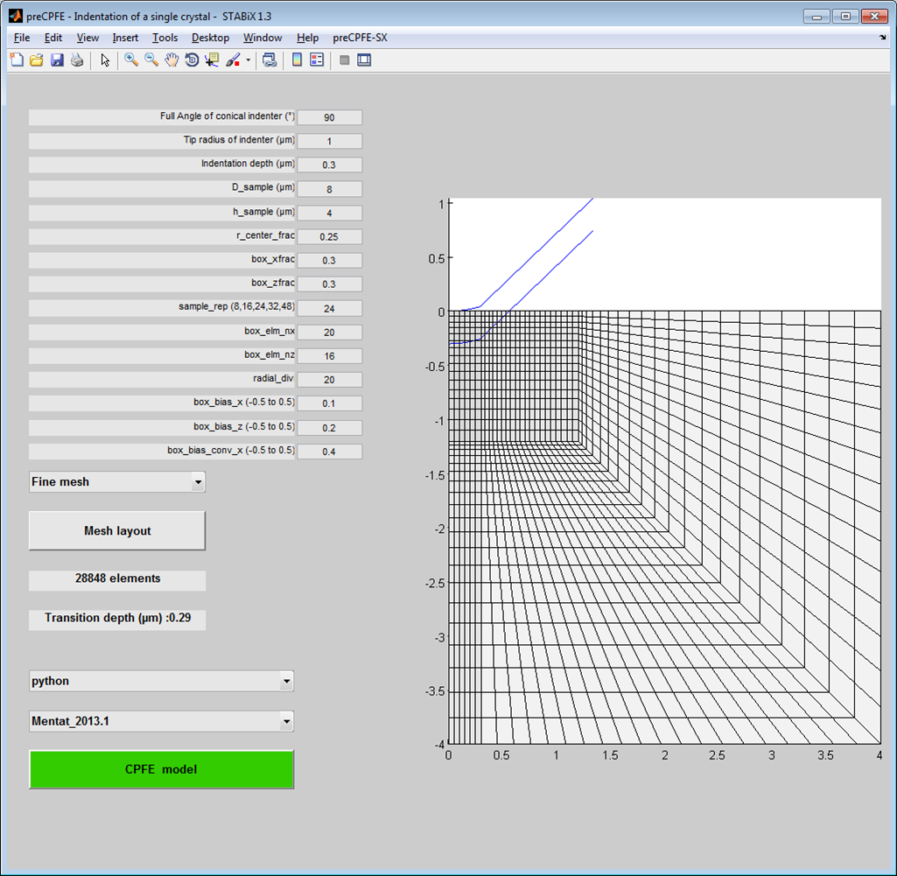
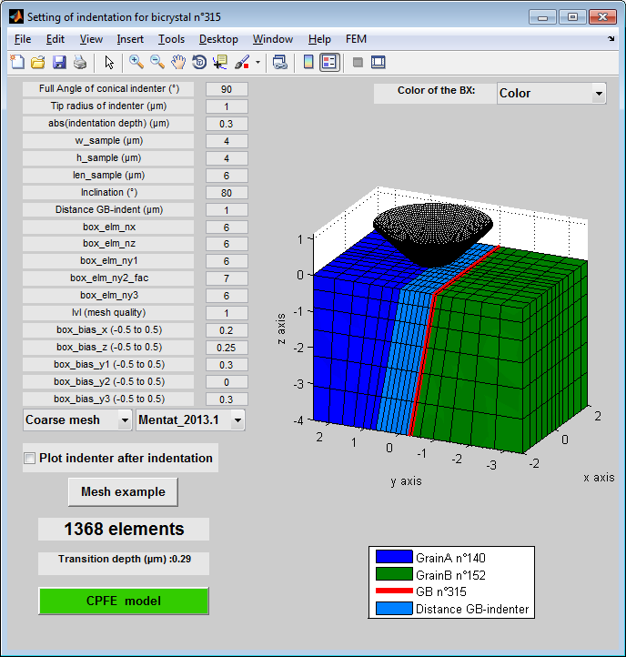

CPFE SX and BX Indentation models
=================================
..  include:: <isonum.txt>
..  |matlab| replace:: Matlab\ :sup:`TM` \

The preCPFE GUI has been created to enable rapid transfer of experimental data into simulation input files,
so that a statistically significant number of indents can be assessed. A parametrized visualization of the bicrystal
indentation model through the GUI allows tuning the geometry and finite element discretization and the size of the sample and the indenter.

The |matlab| function used to run the preCPFE GUI for SX indentation is: `A_femproc_windows_indentation_setting_SX.m <https://github.com/czambaldi/stabix/tree/master/gui_preCPFE/A_femproc_windows_indentation_setting_SX.m>`_

The |matlab| function used to run the preCPFE GUI for BX indentation is: `A_femproc_windows_indentation_setting_BX.m <https://github.com/czambaldi/stabix/tree/master/gui_preCPFE/A_femproc_windows_indentation_setting_BX.m>`_

This includes:

* :ref:`single_crystal_indentation`
* :ref:`bicrystal_indentation`

.. _single_crystal_indentation:

Single crystal indentation
--------------------------

..    include:: <isonum.txt>

   
   *Figure 1 : Screenshot of the preCPFE GUI for the single crystal indentation*
   
Convention for the single crystal mesh
**************************************

.. figure:: ./_pictures/Schemes_SlipTransmission/SX_indentation_mesh_example.png
   :scale: 25 %
   :align: center
   
   *Figure 2 : Convention used to define the single crystal mesh.*
   
.. _bicrystal_indentation:

Bicrystal indentation
---------------------

..    include:: <isonum.txt>

   
   *Figure 3 : Screenshot of the preCPFE GUI for the bicrystal indentation*
   
Convention for the bicrystal mesh
*********************************

.. figure:: ./_pictures/Schemes_SlipTransmission/BX_indentation_mesh_example.png
   :scale: 25 %
   :align: center
   
   *Figure 4 : Convention used to define the bicrystal mesh.*