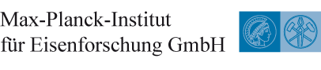

References
==============

Related Projects
##################

.. figure:: ./_pictures/logos/logo_MTEX.png
   :scale: 50%
   :align: center
   :target: http://mtex-toolbox.github.io/
   
   `MTEX <http://mtex-toolbox.github.io/>`_

.. figure:: ./_pictures/logos/logo_DAMASK.png
   :scale: 40%
   :align: center
   :target: http://damask.mpie.de/
   
   `DAMASK <http://damask.mpie.de/>`_

Institutions
##################

   
   `Max-Planck-Institut fuer Eisenforschung GmbH (Duesseldorf, Germany) <http://www.mpie.de/>`_

   
   `Department of Chemical Engineering and Materials Science / Michigan State University (East Lansing, MI, USA) <https://www.msu.edu/>`_

.. figure:: ./_pictures/logos/logo_IMDEA.png
   :scale: 80%
   :align: center
   :target: http://www.imdea.org/
   
   `IMDEA Materials Institute (Madrid, Spain) <http://www.imdea.org/>`_

   
   `Structural Integrity, Institute of Materials Engineering Australian Nuclear Science and Technology Organisation (Australia) <http://www.ansto.gov.au/>`_

   
   `Physikalische Metallkunde TU Darmstadt (Darmstadt, Germany) <http://www.tu-darmstadt.de/>`_

   
   `RWTH Aachen University (Aachen, Germany) <http://www.rwth-aachen.de/>`_
   