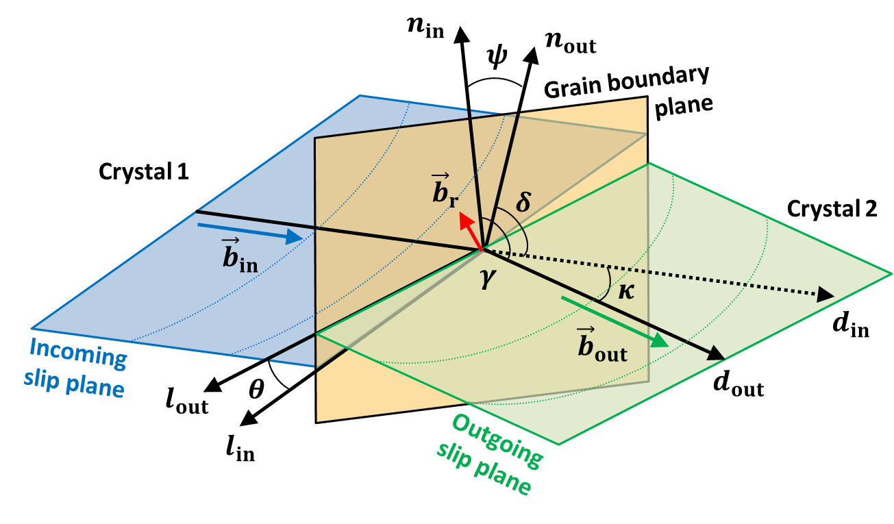

Strain Transfer Across Grain Boundaries
=======================================
..  include:: <isonum.txt>
..  |matlab| replace:: Matlab\ :sup:`TM` \

The strain transfer across grain boundaries can be defined by the four following mechanisms (see Figure 1) [#LimRaj_1985_1]_, [#SuttonBalluffi_1995]_, [#Zaefferer_2003]_ and [#Priester_2013]_ :

 1) direct transmission with slip systems having the same Burgers vector, and the grain boundary is transparent to dislocations (no strengthening effect) (Figure 1-a);

 2) direct transmission, but slip systems have different Burgers vector (leaving a residual boundary dislocations) (Figure 1-b);

 3) indirect transmission, and slip systems have different Burgers vector (leaving a residual boundary dislocations) (Figure 1-c);

 4) no transmission and the grain boundary acts as an impenetrable boundary, which implies stress accumulations, localized rotations, pile-up of dislocations... (Figure 1-d).

.. figure:: ./_pictures/Schemes_SlipTransmission/slip_transfer.png
   :scale: 40 %
   :align: center
   
   *Figure 1 : Possible strain transfer across grain boundaries from Sutton and Balluffi.*
   
Several authors proposed slip transfer parameters from modellings or experiments for the last 60 years.
A non-exhaustive list of those criteria is given in the next part of this work, including geometrical parameter, stress and energetic functions, and recent combinations of the previous parameters.

Geometrical Criteria
--------------------
Based on numerous investigations of dislocation-grain boundary interactions, quantitative geometrical expressions describing the slip transmission mechanisms have been developed. 
A non-exhaustive list of geometrical criteria is detailed subsequently.
The geometry of the slip transfer event is most of the time described by the scheme given Figure 2.
:math:`\kappa` is the angle between slip directions, :math:`\theta` is the angle between the two slip plane intersections with the grain boundary,
:math:`\psi` is the angle between slip plane normal directions, :math:`\gamma` is the angle between the direction of incoming slip and the plane normal of outgoing slip,
and :math:`\delta` is between the direction of outgoing slip and the plane normal of incoming slip.
:math:`n`, :math:`d` and :math:`l` are respectively the slip plane normals, slip directions and the lines of intersection of the slip plane and the grain boundary.
:math:`\vec b` is the Burgers vector of the slip plane and :math:`\vec b_r` is the residual Burgers vector of the residual dislocation at the grain boundary.
The subscripts :math:`in` and :math:`out` refer to the incoming and outgoing slip systems, respectively.
  

   
   *Figure 2 : Geometrical description of the slip transfer.*
   
* :math:`N` **factor from Livingston and Chalmers in 1957** [#LivingstonChalmers_1957]_ 

    .. math:: N = (n_{in} \cdot n_{out})*(d_{in} \cdot d_{out}) + (n_{in} \cdot d_{out})*(n_{out} \cdot d_{in})
        :label: n_factor
        
    .. math:: N = \cos(\psi)\cdot\cos(\kappa) + \cos(\gamma)\cdot\cos(\delta)
        :label: n_factor_angle
        
  Many authors referred to this criterion to analyze slip transmission [#HauserChamlers_1961]_, [#Davis_1966]_, [#HookHirth_1967_1]_, [#HookHirth_1967_2]_, [#Shen_1986]_, [#Shen_1988]_, [#Lee_1990_1]_, [#Lee_1990_2]_, [#Clark_1992]_ and [#Ueda_2002]_.
  Pond et al. proposed to compute this geometric criteria for hexagonal metals using Frank's method [#Pond_1986]_.      

  The |matlab| function used to calculate the N factor is: `N_factor.m <../../../slip_transfer/N_factor.m>`_
  
* :math:`LRB` **factor from Shen et al. in 1986** [#Shen_1986]_ and [#Shen_1988]_

    .. math:: LRB = (l_{in} \cdot l_{out})*(d_{in} \cdot d_{out})
        :label: LRB_factor
        
    .. math:: LRB = \cos(\theta)\cdot\cos(\kappa)
        :label: LRB_factor_angle
        
  The original notation of this :math:`LRB` factor is :math:`M`, but unfortunately this notation is often used for Taylor factor [#Bieler_2014]_ .
  Pond et al. proposed to compute this geometric criteria for hexagonal metals using Frank's method [#Pond_1986]_. 
  Recently, Spearot and Sangid have plotted this parameter in function of the misorientation of the bicrystal using atomistic simulations [#SpearotSangid_2014]_.
  
  [#Lee_1989]_, [#Lee_1990_1]_, [#Lee_1990_2]_, [#Clark_1992]_, [#Kehagias_1995]_, [#Kehagias_1996]_, [#Ashmawi_2001]_, [#Gemperle_2004]_, [#Gemperlova_2004]_ and [#Shi_2011]_ mentioned in their respective studies this geometrical parameter as a condition for slip transmission.
  
  The inclination of the grain boundary (:math:`\beta`) is required to evaluate this factor and the :math:`LRB` or :math:`M` factor should be maximized.
  
  The |matlab| function used to calculate the LRB factor is: `LRB_parameter.m <../../../slip_transfer/LRB_parameter.m>`_

* :math:`m'` **parameter from Luster and Morris in 1995** [#LusterMorris_1995]_
        
    .. math:: m' = (n_{in} \cdot n_{out})*(d_{in} \cdot d_{out}) 
        :label: m_prime
        
    .. math:: m' = \cos(\psi)\cdot\cos(\kappa)
        :label: m_prime_angle

  Many authors found that this :math:`m'` parameter which takes into account the degree of coplanarity of slip systems, is promising to predict slip transmission [#WangNgan_2004]_, [#WoNgan_2004]_, [#Britton_2009]_, [#Bieler_2009]_, [#Bieler_2014]_ and [#Guo_2014]_.
  Both :math:`m'` and :math:`LRB` can be easily assessed in computational experiments [#Bieler_2014]_ .
  This :math:`m'` factor should be maximized (1 means grain boundary is transparent and 0 means grain boundary is an impenetrable boundary).
  
  .. figure:: ./_pictures/Schemes_SlipTransmission/mprime_values.png
   :scale: 30 %
   :align: center
   
   *Figure 3 : Distribution of m' parameter in function of angles values.*
   
  .. figure:: ./_pictures/Schemes_SlipTransmission/mprime_values_vs_misorientation.png
   :scale: 65 %
   :align: center
   
   *Figure 4 : Distribution of m' parameter calculated for prismatic <a> slip systems in function of  misorientation angle.*
   
   A resistance factor of the grain boundary can be described by the following equation : 
   
    .. math:: GB_{res_fac} = 1 - m'
        :label: resistance_factor
        
  This factor is equal to 0 (grain boundary transparent if the :math:`m'` parameter is equal to 1 (when grains perfectly aligned).
   
  The |matlab| function used to calculate the m' parameter is: `mprime.m <../../../slip_transfer/mprime.m>`_
     
* :math:`\vec b_r` **the residual Burgers vector** [#Marcinkowski_1970]_, [#Bollmann_1970]_, [#LimRaj_1985_1]_, [#LimRaj_1985_2]_, [#Clark_1989]_, [#Lee_1990_2]_ and [#Clark_1992]_.
    .. math:: \vec b_r = g_{in}\cdot\vec b_{in} - g_{out}\cdot\vec b_{out}
        :label: residual_burgers_vector
        
  This magnitude of this residual Burgers vector should be minimized.
  
  Shirokoff et al., Kehagias et al. and Kacher et al. used the residual Burgers vector as a criterion to analyse slip transmission in cp-Ti (HCP) [#Shirokoff_1993]_, [#Kehagias_1995]_, [#Kehagias_1996]_ and [#KacherRobertson_2014]_,
  Lagow et al. in Mo (BCC) [#Lagow_2001]_, Gemperle et al. and Gemperlova et al. in FeSi (BCC) [#Gemperle_2004]_ and [#Gemperlova_2004]_, Kacher et al. in 304 stainless steel (FCC) [#KacherRobertson_2012]_,
  and Jacques et al. for semiconductors [#Jacques_1990]_.
  
  Patriarca et al. demonstrated for BCC material the role of the residual Burgers vector in predicting slip transmission, by analysing strain field across GBs determined by digital image correlation [#Patriarca_2013]_. 
  
  Misra and Gibala used the residual Burgers vector to analyze slip across a fcc/bcc interphase boundary [#MisraGibala_1999]_.
  
  The |matlab| function used to calculate the residual Burgers vector is: `residual_Burgers_vector.m <../../../slip_transfer/residual_Burgers_vector.m>`_
 
* **The misorientation or disorientation** (:math:`\Delta g` or :math:`\Delta g_d`)  [#AustChen_1954]_, [#ClarkChalmers_1954]_ and [#WoNgan_2004]_

  It has been observed during first experiments of bicrystals deformation in 1954, that the yield stress and the rate of work hardening increased with the orientation difference between the crystals [#AustChen_1954]_ and [#ClarkChalmers_1954]_.
  
  Some authors demonstrated a strong correlation between misorientation between grains in a bicrystal and the grain boundary energy through crystal plasticity finite elements modelling and
  molecular dynamics simulations [#SuttonBalluffi_1995]_, [#Ma_2006]_, [#Li_2009]_, [#Bachurin_2010]_, [#Sangid_2011]_ and [#Sangid_2012]_. Some authors studied the stability of grain boundaries by the calculations
  of energy difference vs. misorientation angle through the hexagonal c-axis/a-axis [#Faraoun_2006]_.
 
  The |matlab| function used to calculate the misorientation angle is: `misorientation.m <../../../crystallo/misorientation.m>`_

Stress Criteria
---------------
* **Schmid Factor** (:math:`m`) [#Reid_1973]_, [#Seal_2012]_ and [#Abuzaid_2012]_

  The Schmid's law can be expressed by the following equation:
  
    .. math:: \tau^{i} = \sigma : {S_0}^{i}
        :label: schmid_factor
        
    .. math:: {S_0}^{i} = d \otimes n
        :label: schmid_matrix
  
  :math:`\sigma` is an arbitrary stress state and :math:`\tau^{i}` the resolved shear stress.
  :math:`{S_0}^{i}` is the Schmid matrix defined by the dyadic product of the slip plane normals :math:`n` and the slip directions :math:`d` of the slip system :math:`i`.
  The Schmid factor, :math:`m`, is defined as the ratio of the resolved shear stress :math:`\tau^{i}` to a given uniaxial stress.
  
  Knowing the value of the highest Schmid factor of a given slip system for both grains in a bicrystal, Abuzaid et al. [#Abuzaid_2012]_ proposed the following criterion :

    .. math:: m_{GB} = m_{in} + m_{out}
        :label: schmid_factor_gb
        
  The subscripts :math:`GB`, :math:`in` and :math:`out` refer to the grain boundary, and the incoming and outgoing slip systems, respectively.
  This GB Schmid factor (:math:`m_{GB}`) factor should be maximized.
  
  The |matlab| function used to calculate the Schmid factor is: `resolved_shear_stress.m <../../../crystal_plasticity/resolved_shear_stress.m>`_
  
* **Generalized Schmid Factor** (:math:`GSF`) [#Reid_1973]_ and [#Bieler_2014]_

  The generalized Schmid factor, which describes the shear stress on a given slip system, can be
  computed from any stress tensor :math:`\sigma` based on the Frobenius norm of the tensor.

    .. math:: GSF = d \cdot g \sigma g^T \cdot n^T
        :label: generalized_schmid_factor
    
  :math:`n` and :math:`d` are respectively the slip plane normals and the slip directions of the slip system. The superscript :math:`T` is the transpose notation and :math:`g` is the orientation matrix for a given crystal.
        
  The |matlab| function used to calculate the generalized Schmid factor is: `generalized_schmid_factor.m <../../../crystal_plasticity/generalized_schmid_factor.m>`_
        
* **Resolved Shear Stress** (:math:`\tau`) [#Lee_1989]_, [#Lee_1990_1]_, [#Lee_1990_2]_, [#Clark_1992]_, [#Lagow_2001]_, [#Bieler_2009]_,  [#Dewald1_2007]_, [#Dewald2_2007]_ and [#Dewald3_2011]_
  
  The resolved shear stress :math:`\tau` acting on the outgoing slip system from the piled-up dislocations should be maximized. This criterion considers the local stress state.
  
  The resolved shear stress on the grain boundary should be minimized.
  
  For Shi and Zikry, the ratio of the resolved shear stress to the reference shear stress of the outgoing slip system (stress ratio) should be greater than a critical value (which is approximately 1) [#Shi_2011]_.
  
  For Li et al. and Gao et al. the resolved shear stress acting on the incoming dislocation on the slip plane must be larger than the critical penetration stress.
  From the energy point of view, only when the work by the external force on the incoming dislocation is greater than the summation of the GB energy
  and strain energy of GB dislocation debris, it is possible that the incoming dislocation can penetrate through the GB [#Li_2009]_ and [#Gao_2011]_.
  
  It is possible to assess the shear stress from the geometrical factor :math:`N` (Livingston and Chamlers) :
    
    .. math:: \tau_{in} = \tau_{out} * N
        :label: shear_stress_n_factor
    
  Where :math:`\tau_{out}` is the shear stress at the head of the accumulated dislocations in their slip plane and
  :math:`\tau_{in}` is the shear acting on the incoming slip system [#LivingstonChalmers_1957]_,  [#HookHirth_1967_1]_ and [#HookHirth_1967_2]_.
  
  The |matlab| function used to calculate the resolved shear stress is: `resolved_shear_stress.m <../../../crystal_plasticity/resolved_shear_stress.m>`_

Combination of Criteria
-----------------------

* **Geometrical function weighted by the accumulated shear stress or the Schmid factor** [#Bieler_2014]_ (not yet implemented...)

Slip transmission parameters implemented in the |matlab| Toolbox
---------------------------------------------------------------------------
.. csv-table::
   :header: "Slip transmission parameter", "Function", "|matlab| function", "Reference"
   :widths: 40, 40, 20, 10

   "Misorientation angle (:math:`\omega`)", ":math:`\omega = cos^{-1}((tr(\Delta g)-1)/2)`", `misorientation.m <../../../crystallo/misorientation.m>`_, [#SuttonBalluffi_1995]_
   "C-axis misorientation angle (for hcp material) (:math:`\omega`)", , `c-axis misorientation.m <../../../crystallo/eul2Caxismisor.m>`_, [#SuttonBalluffi_1995]_
   ":math:`N` factor from Livingston and Chamlers", ":math:`N = \cos(\psi)\cdot\cos(\kappa) + \cos(\gamma)\cdot\cos(\delta)`", `N_factor.m <../../../slip_transfer/N_factor.m>`_, [#LivingstonChalmers_1957]_
   ":math:`LRB` factor from Shen et al.", ":math:`LRB = \cos(\theta)\cdot\cos(\kappa)`", `LRB_parameter.m <../../../slip_transfer/LRB_parameter.m>`_
   ":math:`m'` parameter from Luster and Morris", ":math:`m' = \cos(\psi)\cdot\cos(\kappa)`", `mprime.m <../../../slip_transfer/mprime.m>`_, [#LusterMorris_1995]_
   "Residual Burgers vector (:math:`\vec b_r`)", ":math:`\vec b_r = g_{in}\cdot\vec b_{in} - g_{out}\cdot\vec b_{out}`", `residual_Burgers_vector.m <../../../slip_transfer/residual_Burgers_vector.m>`_, [#Marcinkowski_1970]_
   "Resolved Shear Stress (:math:`\tau^{i}`) / Schmid Factor", ":math:`\tau^{i} = \sigma : {S_0}^{i}` with :math:`{S_0}^{i} = d \otimes n`", `resolved_shear_stress.m <../../../crystal_plasticity/resolved_shear_stress.m>`_, [#Reid_1973]_
   "Grain boundary Schmid factor", ":math:`m_{GB} = m_{in} + m_{out}`", `resolved_shear_stress.m <../../../crystal_plasticity/resolved_shear_stress.m>`_, [#Abuzaid_2012]_
   "Generalized Schmid Factor (:math:`GSF`)", ":math:`GSF = d \cdot g \sigma g^T \cdot n^T`", `generalized_schmid_factor.m <../../../crystal_plasticity/generalized_schmid_factor.m>`_, [#Reid_1973]_

References
----------
.. [#Abuzaid_2012] `W.Z. Abuzaid et al., "Slip transfer and plastic strain accumulation across grain boundaries in Hastelloy X.", J. of the Mech. and Phys. of Sol. (2012), 60(6) ,pp. 1201–1220. <http://dx.doi.org/10.1016/j.jmps.2012.02.001>`_
.. [#Ashmawi_2001] `W.M. Ashmawi and M.A. Zikry, "Prediction of Grain-Boundary Interfacial Mechanisms in Polycrystalline Materials.", Journal of Engineering Materials and Technology (2001), 124(1), pp. 88-96. <http://dx.doi.org/10.1115/1.1421611>`_
.. [#AustChen_1954] `K.T. Aust and N.K. Chen, "Effect of orientation difference on the plastic deformation of aluminum bicrystals.", Acta Metallurgica (1954), 2, pp. 632-638. <http://dx.doi.org/10.1016/0001-6160(54)90199-6>`_
.. [#Aust_1968] `K.T. Aust et al., "Solute induced hardening near grain boundaries in zone refined metals.", Acta Metallurgica (1968), 16(3), pp. 291-302. <http://dx.doi.org/10.1016/0001-6160(68)90014-X>`_
.. [#Bachurin_2010] `D.V. Bachurin et al., "Dislocation–grain boundary interaction in <111> textured thin metal films.", Acta Materialia (2010), 58, pp. 5232–5241. <http://dx.doi.org/10.1016/j.actamat.2010.05.037>`_
.. [#Bamford_1988] `T.A. Bamford et al., "A thermodynamic model of slip propagation.", Scripta Metallurgica (1988), 22(12), pp. 1911–1916. <http://dx.doi.org/10.1016/S0036-9748(88)80237-0>`_
.. [#Bieler_2009] `T.R. Bieler et al., "The role of heterogeneous deformation on damage nucleation at grain boundaries in single phase metals.", Int. J. of Plast. (2009), 25(9), pp. 1655–1683. <http://dx.doi.org/10.1016/j.ijplas.2008.09.002>`_
.. [#Bieler_2014] `T.R. Bieler et al., "Grain boundaries and interfaces in slip transfer.", Current Opinion in Solid State and Materials Science (2014), in press. <http://dx.doi.org/10.1016/j.cossms.2014.05.003>`_
.. [#Bollmann_1970] `W. Bollmann, "Crystal Defects and Crystalline Interfaces", Springer-Verlag (1970) <http://dx.doi.org/10.1007/978-3-642-49173-3>`_
.. [#Britton_2009] `T.B. Britton et al., "Nanoindentation study of slip transfer phenomenon at grain boundaries.", J. Mater. Res., 2009, 24(3), pp. 607-615. <http://dx.doi.org/10.1557/jmr.2009.0088>`_
.. [#Britton_2012] `T.B. Britton and A.J. Wilkinson, "Stress fields and geometrically necessary dislocation density distributions near the head of a blocked slip band.", Acta Materialia (2012), 60, pp. 5773–5782. <http://dx.doi.org/10.1016/j.actamat.2012.07.004>`_
.. [#ClarkChalmers_1954] `W.A.T. Clark and B. Chalmers, "Mechanical deformation of aluminium bicrystals.", Acta Metallurgica (1954), 2(1), pp. 80-86. <http://dx.doi.org/10.1016/0001-6160(54)90097-8>`_
.. [#Clark_1989] `W.A.T. Clark et al., "The use of the transmission electron microscope in analyzing slip propagation across interfaces.", Ultramicroscopy (1989), 30(1-2), pp. 76-89. <http://dx.doi.org/10.1016/0304-3991(89)90175-7>`_
.. [#Clark_1992] `W.A.T. Clark et al., "On the criteria for slip transmission across interfaces in polycrystals.", Scripta Metallurgica et Materialia (1992), 26(2), pp. 203–206. <http://dx.doi.org/10.1016/0956-716X(92)90173-C>`_
.. [#Cui_2014] `B. Cui et al., "Influence of irradiation damage on slip transfer across grain boundaries.", Acta Materialia (2014), 65, pp. 150-160. <http://dx.doi.org/10.1016/j.actamat.2013.11.033>`_
.. [#Davis_1966] `K.G. Davis et al., "Slip band continuity across grain boundaries in aluminum.", Acta Metallurgica (1966), 14, pp. 1677-1684. <http://dx.doi.org/10.1016/0001-6160(66)90020-4>`_
.. [#DeKoning_2002] `M. DeKoning et al., "Modelling grain-boundary resistance in intergranular dislocation slip transmission.", Phil. Mag. A (2002), 82(13), pp. 2511-2527. <http://dx.doi.org/10.1080 /0141861021014442 1>`_
.. [#DeKoning_2003] `M. DeKoning et al., "Modeling of dislocation–grain boundary interactions in FCC metals.", Journal of Nuclear Materials (2003), 323, pp. 281–289. <http://dx.doi.org/10.1016/j.jnucmat.2003.08.008>`_
.. [#Dewald1_2007] `M.P. Dewald et al., "Multiscale modelling of dislocation/grain-boundary interactions: I. Edge dislocations impinging on Σ11 (1 1 3) tilt boundary in Al.", Modelling Simul. Mater. Sci. Eng. (2007), 15(1). <http://dx.doi.org/10.1088/0965-0393/15/1/S16>`_
.. [#Dewald2_2007] `M.P. Dewald et al., "Multiscale modelling of dislocation/grain boundary interactions. II. Screw dislocations impinging on tilt boundaries in Al.", Phil. Mag. (2007), 87(30), pp. 1655–1683. <http://dx.doi.org/10.1080/14786430701297590>`_
.. [#Dewald3_2011] `M.P. Dewald et al., "Multiscale modeling of dislocation/grain-boundary interactions: III. 60° dislocations impinging on Σ3, Σ9 and Σ11 tilt boundaries in Al.", Modelling Simul. Mater. Sci. Eng. (2011), 19(5). <http://dx.doi.org/10.1088/0965-0393/19/5/055002>`_
.. [#Eshelby_1951] `J.D. Eshelby et al., "XLI. The equilibrium of linear arrays of dislocations.", Philosophical Magazine Series 7 (1951), 42(327), pp. 351-365. <http://dx.doi.org/10.1080/14786445108561060>`_
.. [#Faraoun_2006] `H. Faraoun et al., "Study of stability of twist grain boundaries in hcp zinc.", Scripta Materialia (2006), 54, pp. 865–868. <http://dx.doi.org/10.1016/j.scriptamat.2005.11.008>`_
.. [#Gao_2011] `Y. Gao et al., "A hierarchical dislocation-grain boundary interaction model based on 3D discrete dislocation dynamics and molecular dynamics." Science China Physics, Mechanics and Astronomy (2011), 54(4), pp. 625-632. <http://dx.doi.org/10.1007/s11433-011-4298-9>`_
.. [#Gemperle_2004] `A. Gemperle et al., "Interaction of slip dislocations with grain boundaries in body-centered cubic bicrystals.", Materials Science and Engineering A (2004), 378-389, pp. 46-50. <http://dx.doi.org/10.1016/j.msea.2004.03.081>`_
.. [#Gemperlova_2004] `J. Gemperlova et al.,"Slip transfer across grain boundaries in Fe–Si bicrystals.", Journal of Alloys and Compounds (2004), 378(1-2), pp. 97-101. <http://dx.doi.org/10.1016/j.jallcom.2003.10.086>`_
.. [#Guo_2014] `Y. Guo et al., "Slip band–grain boundary interactions in commercial-purity titanium.", Acta Materialia (2014), 76, pp. 1-12. <http://dx.doi.org/10.1016/j.actamat.2014.05.015>`_
.. [#HauserChamlers_1961] `J.J. Hauser and B. Chamlers, "The plastic deformation of bicrystals of f.c.c. metals.", Acta Metallurgica (1961), 9(9), pp. 802-818. <http://dx.doi.org/10.1016/0001-6160(61)90183-3>`_
.. [#HookHirth_1967_1] `R.E. Hook and J.P. Hirth, "The deformation behavior of isoaxial bicrystals of Fe-3%Si.", Acta Metallurgica (1967), 15(3), pp. 535-551. <http://dx.doi.org/10.1016/0001-6160(67)90087-9>`_
.. [#HookHirth_1967_2] `R.E. Hook and J.P. Hirth, "The deformation behavior of non-isoaxial bicrystals of Fe-3% Si.", Acta Metallurgica(1967), 15(7), pp. 1099-1110. <http://dx.doi.org/10.1016/0001-6160(67)90383-5>`_
.. [#Jacques_1990] `A. Jacques et al., "New results on dislocation transmission by grain boundaries in elemental semiconductors.", Le Journal de Physique Colloques (1990), 51(C1), pp. 531-536. <http://dx.doi.org/10.1051/jphyscol:1990183>`_
.. [#KacherRobertson_2012] `J. Kacher and I.M. Robertson, "Quasi-four-dimensional analysis of dislocation interactions with grain boundaries in 304 stainless steel.", Acta Materialia (2012), 60(19), pp. 6657–6672. <http://dx.doi.org/10.1016/j.actamat.2012.08.036>`_
.. [#KacherRobertson_2014] `J. Kacher and I.M. Robertson, "In situ and tomographic analysis of dislocation/grain boundary interactions in α-titanium.", Philosophical Magazine (2014), 94(8), pp. 814-829. <http://dx.doi.org/10.1080/14786435.2013.868942>`_
.. [#Kacher_2014] `J. Kacher et al., "Dislocation interactions with grain boundaries.", Current Opinion in Solid State and Materials Science (2014), in press. <http://dx.doi.org/10.1016/j.cossms.2014.05.004>`_
.. [#Kalidindi_2014] `S.R. Kalidindi and S.J. Vachhani, "Mechanical characterization of grain boundaries using nanoindentation.", Current Opinion in Solid State and Materials Science (in press). <http://dx.doi.org/10.1016/j.cossms.2014.05.002>`_
.. [#Kehagias_1995] `T. Kehagias et al., "Slip transfer across low-angle grain boundaries of deformed titanium.", Interface Science (1995), 3(3), pp. 195-201. <http://dx.doi.org/10.1007/BF00191046>`_
.. [#Kehagias_1996] `T. Kehagias et al., "Pyramidal Slip in Electron Beam Heated Deformed Titanium.", Scripta Metallurgica et Materialia (1996), 33(12), pp. 1883-1888. <http://dx.doi.org/10.1016/0956-716X(95)00351-U>`_
.. [#Kobayashi_2005] `S. Kobayashi et al., "Grain boundary hardening and triple junction hardening in polycrystalline molybdenum.", Acta Materialia (2005), 53, pp. 1051–1057. <http://dx.doi.org/10.1016/j.actamat.2004.11.002>`_
.. [#Lagow_2001] `B.W. Lagow, "Observation of dislocation dynamics in the electron microscope.", Materials Science and Engineering: A, 2001, 309–310, pp. 445-450. <http://dx.doi.org/10.1016/S0921-5093(00)01699-3>`_
.. [#Lawrence_2014] `S.K. Lawrence et al., "Grain Boundary Contributions to Hydrogen-Affected Plasticity in Ni-201.", The Journal of The Minerals, Metals & Materials Society (2014), 66(8), pp. 1383-1389. <http://dx.doi.org/10.1007/s11837-014-1062-4>`_
.. [#Lee_1989] `T.C. Lee et al., "Prediction of slip transfer mechanisms across grain boundaries.", Scripta Metallurgica, (1989), 23(5), pp. 799–803. <http://dx.doi.org/10.1016/0036-9748(89)90534-6>`_
.. [#Lee_1990_1] `T.C. Lee et al., "TEM in situ deformation study of the interaction of lattice dislocations with grain boundaries in metals.", Philosophical Magazine A (1990), 62(1), pp. 131-153. <http://dx.doi.org/10.1080/01418619008244340>`_
.. [#Lee_1990_2] `T.C. Lee et al., "An In Situ transmission electron microscope deformation study of the slip transfer mechanisms in metals", Metallurgical Transactions A (1990), 21(9), pp. 2437-2447. <http://dx.doi.org/10.1007/BF02646988>`_
.. [#Li_2009] `Z. Li et al., "Strengthening mechanism in micro-polycrystals with penetrable grain boundaries by discrete dislocation dynamics simulation and Hall–Petch effect.", Computational Materials Science (2009), 46(4), pp. 1124-1134. <http://dx.doi.org/10.1016/j.commatsci.2009.05.021>`_
.. [#LimRaj_1985_1] `L.C. Lim and R. Raj, "Continuity of slip screw and mixed crystal dislocations across bicrystals of nickel at 573K.", Acta Metallurgica (1985), 33, pp. 1577. <http://dx.doi.org/10.1016/0001-6160(85)90057-4>`_
.. [#LimRaj_1985_2] `L.C. Lim and R. Raj, "The role of residual dislocation arrays in slip induced cavitation, migration and dynamic recrystallization at grain boundaries.", Acta Metallurgica (1985), 33(12), pp. 2205-2214. <http://dx.doi.org/10.1016/0001-6160(85)90182-8>`_
.. [#LivingstonChalmers_1957] `J.D. Livingston and B. Chalmers, "Multiple slip in bicrystal deformation.", Acta Metallurgica (1957), 5(6), pp. 322-327. <http://dx.doi.org/10.1016/0001-6160(57)90044-5>`_
.. [#LusterMorris_1995] `J. Luster and M.A. Morris, "Compatibility of deformation in two-phase Ti-Al alloys: Dependence on microstructure and orientation relationships.", Metal. and Mat. Trans. A (1995), 26(7), pp. 1745-1756. <http://dx.doi.org/10.1007/BF02670762>`_
.. [#Ma_2006] `A. Ma et al., "On the consideration of interactions between dislocations and grain boundaries in crystal plasticity finite element modeling – Theory, experiments, and simulations.", Acta Materialia (2006), 54(8), pp.2181-2194. <http://dx.doi.org/10.1016/j.actamat.2006.01.004>`_
.. [#Marcinkowski_1970] `M.J. Marcinkowski and W.F. Tseng, "Dislocation behavior at tilt boundaries of infinite extent.", Metal. Trans. (1970), 1(12), pp. 3397-3401. <http://dx.doi.org/10.1007/BF03037870>`_
.. [#MisraGibala_1999] `A. Misra and R. Gibala, "Slip Transfer and Dislocation Nucleation Processes in Multiphase Ordered Ni-Fe-Al Alloys", Metallurgical and Materials Trans. A (1999), 30A, pp. 991-1001. <http://dx.doi.org/10.1007/s11661-999-0152-3>`_
.. [#Nibur_2003] `K.A. Nibur and D.F. Bahr, "Indentation Techniques for the Study of Deformation Across Grain Boundaries.", Mat. Res. Soc. Symp. Proc. (2003), 778, pp. 129-134. <http://dx.doi.org/10.1557/PROC-778-U4.10>`_
.. [#Ohmura_2005] `T. Ohmura et al., "Nanoindentation-Induced Deformation Behavior in the Vicinity of Single Grain Boundary of Interstitial-Free Steel.", Materials Transactions (2005), 46(9), pp. 2026-2029. <http://dx.doi.org/10.2320/matertrans.46.2026>`_
.. [#Pathak_2009] `S. Pathak et al., "Measurement of the local mechanical properties in polycrystalline samples using spherical nanoindentation and orientation imaging microscopy.", Acta Materialia (2009), 57, pp. 3020–3028. <http://dx.doi.org/10.1016/j.actamat.2009.03.008>`_
.. [#Pathak_2012] `S. Pathak et al., "Studying grain boundary regions in polycrystalline materials using spherical nano-indentation and orientation imaging microscopy.", J. Mater. Sci. (2012), 47, pp. 815–823. <http://dx.doi.org/10.1007/s10853-011-5859-z>`_
.. [#Patriarca_2013] `L. Patriarca et al., "Slip transmission in bcc FeCr polycrystal.", Materials Science&Engineering (2013), A588, pp. 308–317. <http://dx.doi.org/10.1016/j.msea.2013.08.050>`_
.. [#Pond_1986] `R.C. Pond et al., "On the crystallography of slip transmission in hexagonal metals.", Scripta Metallurgica (1986), 20, pp. 1291-1295. <http://dx.doi.org/10.1016/0036-9748(86)90051-7>`_
.. [#Priester_2013] `L. Priester, "Grain Boundaries: From Theory to Engineering.", Springer Series in Materials Science (2013). <http://www.springer.com/materials/surfaces+interfaces/book/978-94-007-4968-9>`_
.. [#ReadShockley_1950] `W.T. Read and W. Shockley, "Dislocation Models of Crystal Grain Boundaries.", Physical Review, 1950, 78(3), pp. 275-289. <http://dx.doi.org/10.1103/PhysRev.78.275>`_
.. [#Reid_1973] `C.N. Reid, "Deformation Geometry for Materials Scientists.", Pergamon Press, Oxford, United Kingdom, 1973. <http://www.sciencedirect.com/science/book/9780080172378>`_
.. [#Sangid_2011] `M.D. Sangid et al., "Energy of slip transmission and nucleation at grain boundaries.", Acta Materialia (2011), 59(1), pp. 283–296. <http://dx.doi.org/10.1016/j.actamat.2010.09.032>`_
.. [#Sangid_2012] `M.D. Sangid et al., "Energetics of residual dislocations associated with slip–twin and slip–GBs interactions.", Materials Science and Engineering A (2012), 542, pp. 21–30. <http://dx.doi.org/10.1016/j.msea.2012.02.023>`_
.. [#Seal_2012] `J.R. Seal et al., "Analysis of slip transfer and deformation behavior across the α/β interface in Ti–5Al–2.5Sn (wt.%) with an equiaxed microstructure.", Mater. Sc. and Eng.: A (2012), 552, pp. 61-68. <http://dx.doi.org/10.1016/j.msea.2012.04.114>`_
.. [#Shan_2013] `D. Shan et al., "Effect of the Σ5(310)/[001]Φ 5 53.1° grain boundary on the incipient yield of bicrystal copper: A quasicontinuum simulation and nanoindentation experiment.", J. Mater. Res. (2013), 28(5), pp. 766-773. <http://dx.doi.org/10.1557/jmr.2012.424>`_
.. [#Shen_1986] `Z. Shen et al., "Dislocation pile-up and grain boundary interactions in 304 stainless steel.", Scripta Metallurgica (1986), 20(6), pp. 921–926. <http://dx.doi.org/10.1016/0036-9748(86)90467-9>`_
.. [#Shen_1988] `Z. Shen et al., "Dislocation and grain boundary interactions in metals.", Acta Metallurgica (1988), 36(12), pp. 3231–3242. <http://dx.doi.org/10.1016/0001-6160(88)90058-2>`_
.. [#Shi_2011] `J. Shi and M.A. Zikry, "Modeling of grain boundary transmission, emission, absorption and overall crystalline behavior in Σ1, Σ3, and Σ17b bicrystals.", J. Mater. Res., (2011), 26(14), pp. 1676-1687. <http://dx.doi.org/10.1557/jmr.2011.192>`_
.. [#Shirokoff_1993] `J. Shirokoff et al., "The Slip Transfer Process Through Grain Boundaries in HCP Ti.", MRS Online Proceedings Library (1993), 319, pp. 263-272. <http://dx.doi.org/10.1557/PROC-319-263>`_
.. [#Soer_2005] `W.A. Soer et al. ,"Incipient plasticity during nanoindentation at grain boundaries in body-centered cubic metals.", Acta Materialia (2005), 53, pp. 4665–4676. <http://dx.doi.org/10.1016/j.actamat.2005.07.001>`_
.. [#SoerDeHosson_2005] `W.A. Soer and J.Th.M. De Hosson, "Detection of grain-boundary resistance to slip transfer using nanoindentation.", Materials Letters (2005), 59, pp. 3192–3195. <http://dx.doi.org/10.1016/j.matlet.2005.03.075>`_
.. [#Soifer_2002] `Y.M. Soifer et al., "Nanohardness of copper in the vicinity of grain boundaries.", Scripta Materialia (2002), 47(12), pp. 799-804. <http://dx.doi.org/10.1016/S1359-6462(02)00284-1>`_
.. [#SpearotSangid_2014] `D.E. Spearot and M.D. Sangid, "Insights on slip transmission at grain boundaries from atomistic simulations.", Current Opinion in Solid State and Materials Science (2014), in press. <http://dx.doi.org/10.1016/j.cossms.2014.04.001>`_
.. [#SuttonBalluffi_1995] `A.P. Sutton and R.W. Balluffi, "Interfaces in Crystalline Materials.", OUP Oxford (1995). <http://ukcatalogue.oup.com/product/9780199211067.do>`_
.. [#Ueda_2002] `M. Ueda et al., "Effect of grain boundary on martensite transformation behaviour in Fe–32 at.%Ni bicrystals.", Science and Technology of Advanced Materials (2002), 3(2), pp. 171. <http://dx.doi.org/10.1016/S1468-6996(02)00004-9>`_
.. [#WangNgan_2004] `M.G. Wang and A.H.W. Ngan,"Indentation strain burst phenomenon induced by grain boundaries in niobium.", Journal of Materials Research (2004), 19(08), pp. 2478-2486. <http://dx.doi.org/10.1557/JMR.2004.0316>`_
.. [#Werner_1990] `E. Werner and W. Prantl, "Slip transfer across grain and phase boundaries.", Acta Metallurgica et Materialia (1990), 38(3), pp. 533-537. <http://dx.doi.org/10.1016/0956-7151(90)90159-E>`_
.. [#WestWas_2013] `E.A. West and G.S. Was, "Strain incompatibilities and their role in intergranular cracking of irradiated 316L stainless steel.", J. of Nucl. Mater. (2013), 441(1-3), pp. 623–632. <http://dx.doi.org/10.1016/j.jnucmat.2012.10.021>`_
.. [#WoNgan_2004] `P.C. Wo and A.H.W. Ngan, "Investigation of slip transmission behavior across grain boundaries in polycrystalline Ni3Al using nanoindentation.", J. Mater. Res. (2004), 19(1), pp. 189-201. <http://dx.doi.org/10.1557/jmr.2004.19.1.189>`_
.. [#Zaefferer_2003] `S. Zaefferer et al., "On the influence of the grain boundary misorientation on the plastic deformation of aluminum bicrystals.", Acta Materialia (2003), 51(16), pp. 4719-4735. <http://dx.doi.org/10.1016/S1359-6454(03)00259-3>`_
